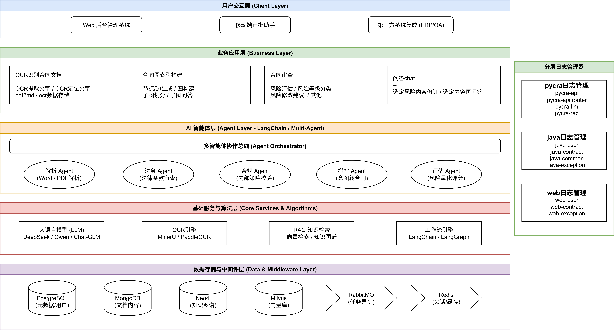

# CRA- A Multi-Agent Collaborative Contract Reviewer System
<div align="center">
  


[](https://github.com/2Elian/cra/issues)

[](./README_CN.md) 
[](./README.md)

**An enterprise-grade intelligent contract review system powered by Large Language Models (LLMs) and Agent technology.**
</div>

<p align="center">
  
</p>

---

## Features

CRA is designed to transform the traditional manual contract review process into an intelligent, efficient, and standardized workflow.

*   **Intelligent Contract Review**: Automatically identifies risks (liabilities, termination clauses, indemnities) and compliance issues using AI agents.
*   **Smart Drafting**: Generates contract drafts based on templates and structured inputs with AI assistance.
*   **Optimization & Rewrite**: Provides suggestions for clause improvements and compares risks between versions.
*   **Knowledge Management**: Built-in Knowledge Graph (RAG) to store and retrieve legal regulations, internal policies, and historical cases.
*   **Human-in-the-loop**: Ensures legal experts have the final say while reducing their workload by up to 80%.

## Architecture

The system follows a modern microservices architecture:

*   **Frontend**: Next.js (React) + Tailwind CSS.
*   **Backend (Business)**: Java Spring Boot services (`cra-user-service`, `cra-contract-service`) handling user management, permissions, and contract workflows.
* **AI Engine:** Python (FastAPI), agent orchestration based on LangChain and LangGraph, knowledge base retrieval based on GraphRAG/LightRAG/ROGRAG. Other modules are based on GraphGen and self-developed technologies.

* **Data Storage:**

  * PostgreSQL (business data)

  * MongoDB (contract data)

  * Elasticsearch (basic search engine)

  * Redis (caching)

  * Qdrant (RAG vector database)

  * neo4j (graph database)

## 🚀 Deployment

### Quick Start with Docker Compose

1.  Clone the repository:
    ```bash
    git clone https://github.com/2Elian/cra.git
    cd cra
    ```

2.  Start the services:
    ```bash
    cd deploy/compose
    docker-compose up -d
    ```

## 🔮 Future Plans

*   **V2.0**: Advanced contract optimization with semantic comparison and multi-tenant support.
*   **Long-term**: Deep learning optimization for specific legal domains, multi-language support, and open API ecosystem.

## Author


**pycra** is independently developed by Elian, an AI algorithm engineer. His research interests lie in post-training of LLM-RL and agent development.


## Star History

[](https://star-history.com/#2Elian/cra&Date)