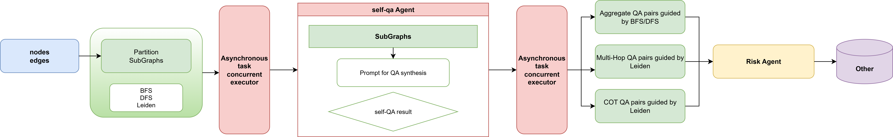

# CRA- 一个多智能体协作的合同审查系统
<div align="center">
  


[](https://github.com/2Elian/cra/issues)

[](./README_CN.md) 
[](./README.md)

**An enterprise-grade intelligent contract review system powered by Large Language Models (LLMs) and Agent technology.**
</div>

<p align="center">
  
</p>

---

## 功能特征

CRA 旨在将传统的人工合同审查流程转化为智能、高效、标准化的工作流。

*   **智能合同审查**：利用 AI Agent 自动识别合同中的风险点（如责任限制、终止条款、赔偿条款）及合规性问题。
*   **智能起草**：基于预设模板和结构化输入，辅助生成合规的合同草稿。
*   **条款优化与改写**：提供条款修改建议，并对比修改前后的风险变化。
*   **知识管理**：内置知识图谱（RAG），整合法律法规、企业内部政策及历史案例，实现经验复用。
*   **人机协同**：保持人类专家的最终决策权，同时减少 80% 的重复性工作。

## 🏗 技术架构

*   **前端**：Next.js (React) + Tailwind CSS
*   **后端（业务层）**：Java Spring Boot 微服务 (`cra-user-service`, `cra-contract-service`)，处理用户管理、权限及合同流转。
*   **AI 引擎**：Python (FastAPI)，Agent编排基于 LangChain 和 LangGraph， 知识库检索基于GraphRAG/LightRAG/ROGRAG。其余模块参考于GraphGen与自研。
*   **数据存储**：
    *   PostgreSQL（业务数据）
    *   MongoDB (合同数据)
    *   elasticsearch (基础搜索引擎)
    *   Redis（缓存）
    *   Qdrant（RAG向量数据库）
    *   neo4j (图数据库)

## 部署指南

### Docker Compose 快速启动

1.  克隆项目代码：
    ```bash
    git clone https://github.com/2Elian/cra.git
    cd cra
    ```

2.  启动服务：
    ```bash
    cd deploy/compose
    docker-compose up -d
    ```

## 核心模块

### 1. Current Contract build a Knowledge Graph
pedding

### 2. Self-QA Module


## 🔮 未来计划

*   **V2.0 版本**：引入高级合同优化功能，支持语义级对比及多租户架构。
*   **长期规划**：针对特定法律领域的深度学习优化，支持多语言环境，并构建开放 API 生态。

## 👥 关于作者


**pycra** 由人工智能算法工程师 Elian 独立开发。他的研究方向是 LLM-RL 的后训练和Agent开发。

## Star

[](https://star-history.com/#2Elian/cra&Date)