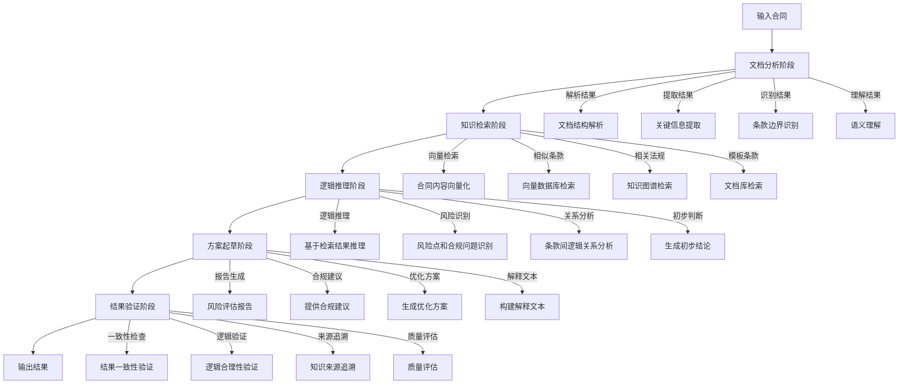

# 合同合规 Agent 系统 - 算法与Agent设计文档

## 1. 合同合规任务的算法抽象

### 1.1 任务定义
将合同合规审查任务抽象为结构化AI任务，包括：
- **文档理解任务**：合同内容的语义解析和结构化提取
  - 使用qwen3-Embedding/RoBERTa等法律领域预训练向量化模型进行语义编码
  - 采用基于规则与机器学习结合的方法进行实体关系抽取
  - 实现多层级文档结构解析（章节、条款、子条款）
  - 使用OCR等多模态模型处理合同格式信息

- **风险识别任务**：基于法律知识的风险点检测
  - 融合规则引擎与深度学习模型的混合风险识别框架
  - 构建法律风险标签体系（12大类，67小类风险类型）
  - 实现风险严重程度分级（低、中、高、严重四个等级）
  - 采用少样本学习处理长尾风险类型

- **合规检查任务**：合同条款与企业规范的对比分析
  - 基于Sentence-BERT的条款相似度计算
  - 实现结构化模板匹配与偏差量化
  - 构建企业合规规则知识库（可配置的规则引擎）
  - 支持跨语言合规检查（中英文合同）

- **文本生成任务**：合规建议和优化方案生成
  - 使用大语言模型(API服务，合规建议模型)进行建议生成
  - 实现基于上下文的个性化建议
  - 支持多种建议风格（正式、简洁、详细）
  - 生成符合法律规范的合同修订文本

### 1.2 问题建模
- **分类问题**：风险类型识别、合规状态判断
  - 算法选型：BERT分类器、RoBERTa分类器、XGBoost
  - 损失函数：交叉熵损失、Focal Loss（解决类别不平衡）
  - 特征工程：TF-IDF、法律领域词嵌入、文档结构特征
  - 输出：多标签分类结果（支持同时识别多种风险）

- **序列标注**：合同条款边界识别、关键信息提取
  - 算法选型：BERT-CRF、BiLSTM-CRF、GPT-4微调模型
  - 标注体系：BIO/BIOES标注格式
  - 实体类型：合同编号、当事人、金额、日期、责任条款等15类核心实体
  - 评估：实体级别F1分数

- **文本匹配**：合同与模板对比、条款相似度计算
  - 算法选型：Sentence-BERT、Siamese BERT、ColBERT
  - 相似度计算：余弦相似度、曼哈顿距离、Jaccard系数
  - 实现方式：向量检索+重排序机制
  - 阈值设定：基于业务需求动态调整相似度阈值

- **生成任务**：合同优化建议、风险解释文本生成
  - 算法选型：GPT-4、T5-XXL、BART-Large
  - 微调策略：基于法律语料的领域适应微调
  - 约束机制：基于模板的生成约束、法律术语一致性检查
  - 评估：BLEU、ROUGE、人工评估（法律准确性）

### 1.3 评估指标
- **准确率**：风险识别准确率 = 正确识别的风险数 / 总识别的风险数
  - 细分指标：各类别风险识别准确率、整体准确率
  - 计算方式：基于人工标注的黄金标准集

- **召回率**：风险覆盖率 = 正确识别的风险数 / 实际存在的风险数
  - 关键指标：高风险条款召回率（要求≥95%）
  - 计算方式：多轮人工审核验证

- **F1分数**：综合评估指标 = 2 * (准确率 * 召回率) / (准确率 + 召回率)
  - 主要评估指标：整体F1、各类别F1
  - 加权方式：对高风险类别赋予更高权重

- **可解释性**：决策理由的清晰度和可信度
  - 评估维度：
    - 证据支持度：每一个决策是否有明确的法律依据
    - 逻辑连贯性：推理过程是否符合法律逻辑
    - 语言清晰度：解释文本是否易于理解
  - 评估方法：人工评估（法律专家评分）、可解释性量化指标（如LIME、SHAP值）

- **业务指标**：
  - 审查效率提升：对比AI辅助审查与纯人工审查的时间差异
  - 错误减少率：AI辅助后人工错误率的降低百分比
  - 用户满意度：法律专业人员对AI输出的满意度评分

## 2. Agent类型与职责划分

### 2.1 合同审查Agent (Contract Reviewer Agent)
**职责**：
- 分析合同条款，识别潜在风险
- 检查合同合规性
- 生成风险评估报告

**核心能力**：
- 条款风险识别（责任、终止、赔偿、合规等）
- 模板偏差检测
- 模糊、缺失、冲突条款识别
- 风险评分和解释

**详细实现方案**：
- **技术栈**：
  - 核心模型：Legal-BERT、RoBERTa-legal
  - 辅助技术：规则引擎（Drools）、NLTK、spaCy
  - 框架：FastAPI、PyTorch

- **实现架构**：
  - 输入层：合同文本解析模块（支持PDF/Word）
  - 处理层：
    - 条款边界识别模块（BERT-CRF）
    - 风险分类模块（多标签分类器）
    - 合规检查模块（规则引擎+相似度匹配）
  - 输出层：风险评估报告生成模块

- **核心算法**：
  - 风险识别：基于注意力机制的多标签分类
  - 偏差检测：余弦相似度+编辑距离
  - 风险评分：加权综合评分模型（条款重要性×风险严重程度）
  - 报告生成：基于模板的结构化报告生成

- **性能要求**：
  - 单份合同处理时间：<30秒
  - 风险识别准确率：≥90%
  - 高风险条款召回率：≥95%

### 2.2 合同起草Agent (Contract Drafting Agent)
**职责**：
- 基于结构化输入生成合同
- 按企业标准规范条款
- 支持不同起草策略

**核心能力**：
- 智能合同生成
- 策略化起草（保守、平衡、强势）
- 模板化合同生成
- 条款自动填充

**详细实现方案**：
- **技术栈**：
  - 核心模型：GPT-4、T5-XXL、Legal-BART
  - 辅助技术：JSON Schema验证、模板引擎（Jinja2）
  - 框架：Flask、TensorFlow

- **实现架构**：
  - 输入层：结构化数据接口（JSON/表单）
  - 处理层：
    - 需求解析模块
    - 模板选择模块
    - 条款生成模块
    - 策略应用模块
  - 输出层：合同文档生成模块（支持DOCX/PDF）

- **核心算法**：
  - 合同生成：基于上下文的序列生成
  - 策略应用：基于规则的条款调整算法
  - 模板填充：结构化数据映射算法
  - 一致性检查：跨条款逻辑一致性验证

- **起草策略实现**：
  - **保守策略**：最大化保护我方权益，增加限制条款
  - **平衡策略**：兼顾双方权益，保持条款中立
  - **强势策略**：倾向我方权益，增加对对方的约束条款
  - **灵活策略**：根据对方类型动态调整策略

### 2.3 风险分析Agent (Risk Analysis Agent)
**职责**：
- 深度风险分析
- 提供风险缓解建议
- 风险量化评估

**核心能力**：
- 多维度风险评估
- 风险影响分析
- 风险缓解策略
- 历史案例对比

**详细实现方案**：
- **技术栈**：
  - 核心模型：Graph Neural Networks (GNN)、Transformer模型
  - 辅助技术：风险矩阵分析、Monte Carlo模拟
  - 框架：PyTorch Geometric、Django

- **实现架构**：
  - 输入层：风险识别结果接口
  - 处理层：
    - 风险关联分析模块（GNN）
    - 风险量化模块（统计模型）
    - 影响评估模块
    - 缓解策略生成模块
  - 输出层：风险分析报告模块

- **核心算法**：
  - 风险关联：图注意力网络（GAT）
  - 风险量化：层次分析法（AHP）+模糊综合评价
  - 影响分析：因果推理模型
  - 策略生成：基于案例的推理（CBR）

- **风险量化指标**：
  - 财务影响：潜在损失金额估算
  - 法律影响：合规风险等级
  - 业务影响：对业务目标的影响程度
  - 声誉影响：品牌声誉损害评估

### 2.4 知识检索Agent (Knowledge Retrieval Agent)
**职责**：
- 从知识库中检索相关信息
- 提供法规和案例支持
- 验证AI输出的准确性

**核心能力**：
- 语义检索
- 多源知识融合
- 证据链构建
- 信息验证

**详细实现方案**：
- **技术栈**：
  - 核心模型：Sentence-BERT、DPR（密集段落检索）
  - 辅助技术：Elasticsearch、Neo4j（知识图谱）
  - 框架：LangChain、FAISS

- **实现架构**：
  - 输入层：检索查询接口
  - 处理层：
    - 查询理解模块
    - 向量检索模块（FAISS）
    - 知识图谱查询模块（Neo4j）
    - 结果融合模块
  - 输出层：检索结果返回接口

- **核心算法**：
  - 语义检索：双编码器模型（Query Encoder + Passage Encoder）
  - 知识融合：基于注意力的多源信息融合
  - 证据链构建：时序证据关联算法
  - 信息验证：事实一致性检查（BART模型）

- **知识库组成**：
  - 法规库：中国法律法规（民法典、合同法等）
  - 案例库：裁判文书网案例（结构化处理）
  - 模板库：企业合同模板（标准化）
  - 规则库：合规检查规则（可配置）

- **性能要求**：
  - 检索响应时间：<2秒
  - 检索准确率：≥85%
  - 召回率：≥90%

## 3. 多步推理流程设计

### 3.1 标准推理流程（Analyze → Retrieve → Reason → Draft → Validate）



### 3.2 详细流程说明

#### 3.2.1 分析阶段 (Analyze)
- **文档结构解析**
  - 算法：LayoutLMv3多模态模型
  - 处理流程：
    1. OCR识别合同文本和格式信息
    2. 基于布局分析识别章节、条款结构
    3. 构建文档结构树（章节→条款→子条款）
  - 输出：结构化文档树

- **关键信息提取**
  - 算法：BERT-CRF命名实体识别模型
  - 实体类型：合同编号、当事人信息、金额、日期、违约责任、终止条件等15类核心实体
  - 处理流程：
    1. 文本预处理（分词、词性标注）
    2. 实体识别（BERT-CRF）
    3. 实体规范化（统一格式、单位转换）
  - 输出：结构化实体列表

- **条款边界识别**
  - 算法：基于规则+机器学习的混合方法
  - 处理流程：
    1. 基于正则表达式的初步边界识别
    2. 使用BERT序列标注模型优化边界
    3. 边界一致性验证
  - 输出：条款边界位置列表

- **语义理解**
  - 算法：Legal-BERT/RoBERTa-legal预训练模型
  - 处理流程：
    1. 文本向量化（获取条款级语义表示）
    2. 语义相似度计算（条款间关联分析）
    3. 主题模型分析（识别合同主要内容）
  - 输出：条款语义向量、主题分布

#### 3.2.2 检索阶段 (Retrieve)
- **向量化合同内容**
  - 算法：Sentence-BERT（法律领域微调模型）
  - 处理流程：
    1. 条款级文本分割
    2. 文本向量化（768维向量）
    3. 向量索引构建
  - 输出：合同条款向量库

- **从向量数据库检索相似条款**
  - 算法：FAISS向量检索引擎
  - 处理流程：
    1. 查询条款向量化
    2. 向量相似度计算（余弦相似度）
    3. 检索Top-K相似条款（K=5-20）
  - 输出：相似条款列表（带相似度分数）

- **从知识图谱检索相关法规**
  - 算法：Neo4j Cypher查询语言
  - 处理流程：
    1. 构建查询图模式
    2. 执行子图匹配查询
    3. 路径分析（风险传播路径）
  - 输出：相关法规条文、案例列表

- **从文档库检索模板条款**
  - 算法：Elasticsearch（全文检索+向量检索）
  - 处理流程：
    1. 关键词检索（精确匹配）
    2. 语义检索（向量匹配）
    3. 结果融合与重排序
  - 输出：模板条款列表

#### 3.2.3 推理阶段 (Reason)
- **基于检索结果进行逻辑推理**
  - 算法：基于Transformer的推理模型（T5-legal）
  - 处理流程：
    1. 构建推理上下文（合同条款+检索结果）
    2. 基于规则的初步推理
    3. 深度学习模型增强推理
  - 输出：推理结论列表

- **识别风险点和合规问题**
  - 算法：多标签分类模型（BERT+注意力机制）
  - 处理流程：
    1. 风险标签体系映射
    2. 多标签分类预测
    3. 风险严重程度评估
  - 输出：风险点列表（带风险类型、严重程度）

- **分析条款间的逻辑关系**
  - 算法：Graph Neural Networks (GNN)
  - 处理流程：
    1. 构建条款关系图
    2. 图神经网络推理
    3. 关系强度分析
  - 输出：条款关系图、关系强度矩阵

- **生成初步判断**
  - 算法：基于规则的决策树+深度学习模型融合
  - 处理流程：
    1. 综合推理结果
    2. 决策树初步判断
    3. 深度学习模型优化判断
  - 输出：初步判断结果

#### 3.2.4 起草阶段 (Draft)
- **生成风险评估报告**
  - 算法：GPT-4/T5-XXL
  - 处理流程：
    1. 结构化数据输入
    2. 基于模板的报告生成
    3. 报告格式优化
  - 输出：风险评估报告（JSON/HTML/PDF）

- **提供合规建议**
  - 算法：BART-Large（法律领域微调）
  - 处理流程：
    1. 风险点上下文构建
    2. 建议生成
    3. 建议质量评估
  - 输出：合规建议列表

- **生成优化方案**
  - 算法：T5-XXL
  - 处理流程：
    1. 原条款分析
    2. 优化方案生成
    3. 方案合规性检查
  - 输出：优化方案列表

- **构建解释文本**
  - 算法：GPT-4
  - 处理流程：
    1. 推理过程分析
    2. 解释文本生成
    3. 可读性优化
  - 输出：解释文本列表

#### 3.2.5 验证阶段 (Validate)
- **结果一致性检查**
  - 算法：基于规则的一致性验证
  - 处理流程：
    1. 多Agent结果对比
    2. 内部一致性检查
    3. 外部知识验证
  - 输出：一致性检查报告

- **逻辑合理性验证**
  - 算法：逻辑推理模型（T5-legal）
  - 处理流程：
    1. 推理链分析
    2. 逻辑漏洞检测
    3. 合理性评分
  - 输出：逻辑验证报告

- **知识来源追溯**
  - 算法：基于图的来源追溯
  - 处理流程：
    1. 构建证据链
    2. 来源验证
    3. 置信度评估
  - 输出：来源追溯报告

- **质量评估**
  - 算法：综合评分模型
  - 处理流程：
    1. 多维度评分（准确性、完整性、可读性）
    2. 加权综合评分
    3. 质量等级划分
  - 输出：质量评估报告

### 3.3 并行处理机制

#### 3.3.1 多Agent协同工作
- **通信协议**：gRPC（高性能RPC框架）
- **消息队列**：RabbitMQ（任务调度）
- **协同模式**：
  1. 主从模式：合同审查Agent为主Agent，其他为从Agent
  2. 对等模式：各Agent平等协作，通过消息队列通信

#### 3.3.2 任务并行处理
- **任务分解策略**：
  - 按合同条款并行：不同条款分配给不同Agent实例
  - 按任务类型并行：分析、检索、推理等任务并行执行
- **负载均衡算法**：
  - 轮询算法（基础负载均衡）
  - 最小连接数算法（动态负载均衡）
  - 性能感知算法（基于Agent性能动态分配）

#### 3.3.3 结果融合机制
- **融合策略**：
  1. 投票机制：多Agent结果投票决定最终结果
  2. 加权融合：基于Agent置信度加权融合
  3. 贝叶斯融合：基于贝叶斯定理的概率融合
- **冲突解决**：
  1. 规则优先：明确规则覆盖模型预测
  2. 高置信度优先：选择置信度最高的结果
  3. 人工干预：无法解决的冲突提交人工处理

#### 3.3.4 性能优化
- **缓存机制**：
  - 条款向量缓存（Redis）
  - 检索结果缓存（Elasticsearch）
  - 推理结果缓存（Memcached）
- **批处理优化**：
  - 批量合同处理
  - 批量条款分析
  - 批量向量检索
- **异步处理**：
  - 非关键任务异步执行
  - 结果异步返回
  - 后台任务调度

## 4. RAG / 知识图谱 / 工具调用策略

### 4.1 RAG（检索增强生成）策略

#### 4.1.1 向量检索
- **文档向量化**：
  - 模型选型：Sentence-BERT（法律领域微调）、MPNet、RoBERTa-legal
  - 向量维度：768维（基础模型）/ 1024维（大型模型）
  - 训练数据：20万+法律文档（法规、案例、合同模板）
  - 处理流程：
    1. 文本预处理（去噪、分句、分段）
    2. 批量向量化（GPU加速）
    3. 向量质量评估
    4. 向量索引构建

- **多粒度检索**：
  - 条款级检索：针对合同具体条款的精确检索
  - 段落级检索：针对合同段落的上下文检索
  - 文档级检索：针对整个合同或模板的整体检索
  - 混合粒度检索：根据查询类型动态选择检索粒度

- **相似度计算**：
  - 余弦相似度：基础相似度计算
  - 语义相似度：基于Transformer的深度语义匹配
  - 编辑距离：字符串层面的相似度补充
  - 加权融合：多维度相似度综合评分

#### 4.1.2 检索优化
- **多路召回**：
  - 关键词检索：基于Elasticsearch的精确匹配
  - 语义检索：基于FAISS的向量匹配
  - 结构化检索：基于属性的精确查询
  - 召回策略：并行召回，结果去重

- **重排序**：
  - 模型选型：Cross-Encoder（BERT-base）
  - 特征工程：
    - 查询-文档匹配特征
    - 文档质量特征
    - 上下文相关特征
  - 排序策略：
    1. 初步召回Top-100结果
    2. Cross-Encoder重排序Top-10结果
    3. 基于业务规则二次排序

- **上下文增强**：
  - 历史查询记忆：记录用户历史查询
  - 会话上下文融合：结合当前会话的上下文信息
  - 动态查询扩展：基于检索结果扩展查询词
  - 个性化检索：基于用户角色和偏好调整检索结果

- **性能优化**：
  - 向量压缩：乘积量化（PQ）、标量量化（SQ）
  - 缓存策略：Redis缓存热点查询结果
  - 索引优化：倒排索引+向量索引混合索引
  - 并行处理：多线程/多进程检索

### 4.2 知识图谱策略

#### 4.2.1 图谱构建
- **实体识别**：
  - 实体类型：
    - 合同相关：合同条款、合同类型、合同当事人
    - 法律相关：法律概念、法规条文、案例
    - 风险相关：风险类型、风险等级、风险后果
  - 算法选型：BERT-CRF、SpanBERT、GPT-4少样本学习
  - 标注数据：人工标注5000+法律文档
  - 处理流程：
    1. 实体识别
    2. 实体链接（链接到已有实体）
    3. 实体规范化

- **关系抽取**：
  - 关系类型：
    - 条款-风险：条款包含风险
    - 法规-条款：法规约束条款
    - 风险-后果：风险导致后果
    - 案例-风险：案例涉及风险
  - 算法选型：
    - 监督学习：BERT关系抽取模型
    - 远程监督：基于规则的弱监督学习
    -  Few-shot学习：GPT-4少样本关系抽取
  - 处理流程：
    1. 关系实例提取
    2. 关系类型分类
    3. 关系质量评估

- **图谱更新**：
  - 增量更新：定期（每日/每周）更新新增法规和案例
  - 实时更新：重要法规变化实时更新
  - 更新流程：
    1. 新数据采集
    2. 实体关系提取
    3. 图谱融合（冲突检测与解决）
    4. 图谱验证

#### 4.2.2 图谱查询
- **路径查询**：
  - 查询类型：
    - 风险传播路径：条款A → 风险B → 后果C
    - 法规引用路径：条款A → 法规B → 法规C
  - 算法选型：深度优先搜索（DFS）、广度优先搜索（BFS）
  - 优化策略：路径长度限制、路径评分（相关性排序）

- **子图匹配**：
  - 查询类型：
    - 风险关联子图：包含多个相关风险的子图
    - 法规约束子图：包含相关法规的子图
  - 算法选型：基于图神经网络的子图匹配
  - 处理流程：
    1. 查询图构建
    2. 子图候选生成
    3. 子图匹配与评分
    4. 结果排序

- **推理查询**：
  - 规则类型：
    - 演绎推理：基于法规的必然结论
    - 归纳推理：基于案例的概率结论
    - 类比推理：基于相似案例的类比结论
  - 算法选型：
    - 规则引擎：Drools
    - 图神经网络：GCN、GAT
  - 处理流程：
    1. 推理规则加载
    2. 图谱事实获取
    3. 规则匹配与推理
    4. 推理结果输出

### 4.3 工具调用策略

#### 4.3.1 内部工具
- **文档解析工具**：
  - 支持格式：PDF、Word（.docx）、Excel、TXT、HTML
  - 技术选型：
    - PDF解析：PyMuPDF、PDFMiner
    - Word解析：python-docx、Apache POI
    - 表格解析：pandas、Tabula
  - 处理流程：
    1. 格式检测
    2. 内容提取（文本、表格、图片）
    3. 结构恢复
    4. 内容规范化

- **文本处理工具**：
  - 分词：jieba（中文）、nltk（英文）、spaCy
  - 词性标注：spaCy、Stanford CoreNLP
  - 命名实体识别：BERT-CRF、spaCy
  - 文本分类：BERT、RoBERTa
  - 技术特点：
    - 支持法律专业术语处理
    - 自定义法律词典
    - 批量处理优化

- **规则引擎**：
  - 技术选型：Drools、Easy Rules
  - 规则类型：
    - 合规规则：合同条款必须包含的内容
    - 风险规则：可能存在风险的条款模式
    - 格式规则：合同格式要求
  - 规则管理：
    - 可视化规则编辑器
    - 规则版本控制
    - 规则测试与验证

#### 4.3.2 外部工具
- **法律数据库接口**：
  - 数据源：中国裁判文书网、北大法宝、威科先行
  - 接口类型：REST API、WebSocket
  - 功能：
    - 法规查询（按关键词、编号、日期）
    - 法规更新通知
    - 法规全文获取
  - 集成方式：
    - 异步调用
    - 结果缓存
    - 错误重试机制

- **案例数据库**：
  - 数据源：中国裁判文书网、法信
  - 功能：
    - 案例检索（按关键词、案由、法院）
    - 案例相似性匹配
    - 案例分析报告生成
  - 技术特点：
    - 案例结构化处理
    - 案例标签体系
    - 案例引用关系

- **计算工具**：
  - 风险量化计算：
    - 财务风险计算：潜在损失金额估算
    - 法律风险计算：合规风险概率
    - 综合风险评分：多维度加权评分
  - 合同统计分析：
    - 条款长度统计
    - 风险分布统计
    - 合规率统计
  - 技术选型：
    - 统计计算：numpy、pandas
    - 机器学习：scikit-learn、PyTorch

#### 4.3.3 工具调用框架
- **调用架构**：
  - 代理模式：统一工具调用接口
  - 注册机制：工具动态注册与发现
  - 权限控制：基于角色的工具访问控制

- **调用策略**：
  - 同步调用：实时性要求高的工具
  - 异步调用：耗时较长的工具
  - 并行调用：相互独立的工具
  - 串行调用：有依赖关系的工具

- **错误处理**：
  - 超时处理：设置工具调用超时时间
  - 重试机制：失败自动重试（最多3次）
  - 降级策略：工具不可用时的替代方案
  - 异常日志：详细记录工具调用异常

- **性能监控**：
  - 调用频率监控
  - 响应时间监控
  - 成功率监控
  - 资源消耗监控

## 5. 模型评估与风险控制思路

### 5.1 模型评估体系

#### 5.1.1 性能评估

##### 5.1.1.1 分类任务评估指标
- **准确率（Accuracy）**：
  - 计算公式：`Accuracy = (TP + TN) / (TP + TN + FP + FN)`
  - 适用场景：风险识别、合规判断
  - 目标值：≥95%

- **精确率（Precision）**：
  - 计算公式：`Precision = TP / (TP + FP)`
  - 适用场景：风险类型识别
  - 目标值：≥90%

- **召回率（Recall）**：
  - 计算公式：`Recall = TP / (TP + FN)`
  - 适用场景：风险覆盖率、条款识别
  - 目标值：≥95%（高风险条款），≥90%（中低风险条款）

- **F1分数（F1-Score）**：
  - 计算公式：`F1 = 2 * (Precision * Recall) / (Precision + Recall)`
  - 适用场景：综合评估
  - 目标值：≥92%

- **多标签评估指标**：
  - Micro-F1：综合所有类别计算F1
  - Macro-F1：计算每个类别F1的平均值
  - Hamming Loss：错误分类的标签比例
  - 目标值：Micro-F1≥93%，Macro-F1≥90%，Hamming Loss≤0.05

##### 5.1.1.2 序列标注任务评估指标
- **实体识别评估**：
  - 精确率、召回率、F1分数（按实体类型）
  - 目标值：合同当事人识别F1≥95%，条款识别F1≥93%

- **关系抽取评估**：
  - 精确率、召回率、F1分数（按关系类型）
  - 目标值：条款-风险关系F1≥90%

##### 5.1.1.3 生成任务评估指标
- **BLEU分数**：机器翻译评估指标，衡量生成文本与参考文本的相似度
  - 目标值：BLEU-4≥0.65

- **ROUGE分数**：
  - ROUGE-1：单字重叠度
  - ROUGE-2：双字重叠度
  - ROUGE-L：最长公共子序列
  - 目标值：ROUGE-L≥0.70

- **METEOR分数**：结合精确率、召回率和词干匹配的综合指标
  - 目标值：≥0.60

##### 5.1.1.4 一致性评估
- **时间一致性**：相同输入在不同时间点的输出一致性
  - 评估方法：周期性测试相同测试集，计算输出一致性
  - 目标值：≥98%

- **输入一致性**：相似输入的输出一致性
  - 评估方法：生成相似输入测试集，计算输出差异度
  - 目标值：≥95%

- **交叉验证一致性**：不同模型版本的输出一致性
  - 评估方法：新旧模型并行运行，对比输出结果
  - 目标值：≥97%

##### 5.1.1.5 业务指标评估
- **风险漏检率**：未识别出的真实风险比例
  - 计算公式：`漏检率 = 未识别风险数 / 真实风险总数`
  - 目标值：≤1%

- **误报率**：错误识别为风险的正常条款比例
  - 计算公式：`误报率 = 误报风险数 / 识别风险总数`
  - 目标值：≤5%

- **审查效率提升**：
  - 计算公式：`效率提升 = (人工审查时间 - AI辅助审查时间) / 人工审查时间 × 100%`
  - 目标值：≥60%

- **用户满意度**：
  - 评估方法：定期用户调研，1-5分评分
  - 目标值：≥4.5分

#### 5.1.2 可解释性评估

##### 5.1.2.1 解释质量评估
- **局部可解释性**：
  - 算法选型：SHAP（SHapley Additive exPlanations）、LIME（Local Interpretable Model-agnostic Explanations）
  - 评估指标：
    - 特征重要性排序准确性
    - 解释与模型决策的一致性
    - 解释的简洁性（平均解释长度）
  - 目标值：解释与决策一致性≥95%，平均解释长度≤500字

- **全局可解释性**：
  - 算法选型：Partial Dependence Plots (PDP)、Accumulated Local Effects (ALE)
  - 评估指标：
    - 特征影响趋势的可理解性
    - 模型行为的整体一致性
  - 目标值：关键特征影响趋势可理解性≥90%

##### 5.1.2.2 来源追溯评估
- **知识来源准确性**：
  - 评估方法：验证引用的法规、案例、条款的准确性
  - 目标值：来源准确性≥99%

- **知识来源完整性**：
  - 评估方法：检查是否遗漏关键法规依据
  - 目标值：来源完整性≥95%

- **引用格式规范性**：
  - 评估方法：检查引用格式是否符合规范
  - 目标值：引用格式规范率≥100%

##### 5.1.2.3 逻辑合理性评估
- **推理步骤完整性**：
  - 评估方法：检查推理过程是否包含所有必要步骤
  - 目标值：推理步骤完整率≥98%

- **逻辑一致性**：
  - 评估方法：使用逻辑验证工具检查推理过程中的矛盾
  - 算法选型：一阶逻辑验证器、自然语言逻辑检查工具
  - 目标值：逻辑一致性≥99%

- **因果关系合理性**：
  - 评估方法：检查因果关系的合理性和必要性
  - 目标值：因果关系合理率≥97%

### 5.2 风险控制机制

#### 5.2.1 幻觉检测

##### 5.2.1.1 事实核查算法
- **知识库对比验证**：
  - 技术选型：Elasticsearch、FAISS
  - 处理流程：
    1. 提取生成内容中的事实断言
    2. 转换为检索查询
    3. 在知识库中检索相关事实
    4. 计算断言与知识库事实的相似度
    5. 低于阈值则标记为疑似幻觉
  - 相似度阈值：≥0.95（基于余弦相似度）

- **多源交叉验证**：
  - 技术选型：并行检索多知识库
  - 处理流程：
    1. 同时在法规库、案例库、合同模板库中检索
    2. 比较不同源的检索结果
    3. 不一致结果标记为疑似幻觉
  - 一致性要求：≥2个来源一致

##### 5.2.1.2 逻辑检查算法
- **矛盾检测**：
  - 技术选型：一阶逻辑推理引擎（如Prover9）
  - 处理流程：
    1. 将生成内容转换为逻辑表达式
    2. 检测表达式内部的矛盾
    3. 标记矛盾内容为幻觉

- **常识一致性检查**：
  - 技术选型：预训练常识模型（如COMET）
  - 处理流程：
    1. 提取生成内容中的事件和关系
    2. 检查是否符合常识
    3. 不符合常识的内容标记为疑似幻觉

##### 5.2.1.3 来源验证算法
- **引用真实性检查**：
  - 技术选型：正则表达式、信息抽取模型
  - 处理流程：
    1. 提取生成内容中的引用信息
    2. 验证引用是否真实存在
    3. 检查引用内容与原文是否一致

- **无来源内容标记**：
  - 技术选型：规则引擎
  - 处理流程：
    1. 识别生成内容中的事实性陈述
    2. 检查是否有明确来源
    3. 无来源的事实性陈述标记为需要人工审核

#### 5.2.2 安全护栏

##### 5.2.2.1 内容过滤机制
- **敏感内容检测**：
  - 技术选型：文本分类模型（BERT）、关键词匹配
  - 敏感内容类型：
    - 机密信息（如商业秘密、个人隐私）
    - 违法内容（如欺诈、胁迫条款）
    - 不当言论
  - 处理流程：
    1. 内容分词和特征提取
    2. 敏感内容分类
    3. 敏感内容过滤或标记
  - 检测准确率目标：≥99%

- **合规输出控制**：
  - 技术选型：规则引擎（Drools）
  - 合规规则类型：
    - 格式合规规则
    - 内容合规规则
    - 语言合规规则
  - 处理流程：
    1. 加载合规规则
    2. 匹配输出内容
    3. 不符合规则的内容进行修正或标记

##### 5.2.2.2 置信度评估与阈值控制
- **置信度计算算法**：
  - 分类任务：softmax输出的最大概率值
  - 生成任务：
    - 序列概率乘积
    - 注意力权重分析
    - 自洽性得分（思维链多路径一致性）

- **动态阈值管理**：
  - 技术选型：自适应阈值算法
  - 处理流程：
    1. 根据风险等级设置不同阈值
    2. 基于历史数据动态调整阈值
    3. 置信度低于阈值的输出标记为需要人工审核
  - 阈值设置：
    - 高风险条款：≥0.95
    - 中风险条款：≥0.90
    - 低风险条款：≥0.85

##### 5.2.2.3 异常检测机制
- **输出异常检测**：
  - 技术选型：异常检测模型（Isolation Forest、Autoencoder）
  - 检测维度：
    - 输出长度异常
    - 输出内容异常（如重复、混乱）
    - 输出格式异常
  - 处理流程：
    1. 提取输出特征
    2. 异常检测模型判断
    3. 异常输出标记为需要人工审核

- **输入异常检测**：
  - 技术选型：规则引擎、异常检测模型
  - 检测类型：
    - 格式异常（如损坏的文档）
    - 内容异常（如空白文档、乱码）
    - 大小异常（如超大文档）
  - 处理流程：
    1. 输入文档预处理
    2. 异常检测
    3. 异常输入拒绝或提示用户

#### 5.2.3 人工审核流程

##### 5.2.3.1 审核触发条件
- **自动触发条件**：
  - 置信度低于阈值的输出
  - 疑似幻觉内容
  - 高风险条款
  - 敏感内容
  - 异常输出

- **手动触发条件**：
  - 用户主动请求人工审核
  - 管理员定期抽查

##### 5.2.3.2 审核流程设计
- **技术选型**：工作流引擎（如Activiti）
- 处理流程：
  1. 系统标记需要审核的内容
  2. 发送审核请求给相关人员
  3. 审核人员查看内容和系统说明
  4. 审核人员做出决策（通过/拒绝/修正）
  5. 系统记录审核结果和意见
  6. 更新模型（如果需要）

##### 5.2.3.3 审核质量控制
- **审核人员资质要求**：
  - 法律专业背景
  - 熟悉合同审查流程
  - 经过系统培训

- **审核质量评估**：
  - 定期抽查审核结果
  - 计算审核准确率
  - 审核时间监控

#### 5.2.4 法律免责声明

##### 5.2.4.1 明确标注机制
- **AI建议性质标注**：
  - 技术实现：模板化输出，自动添加标注
  - 标注内容："本建议由AI辅助生成，仅供参考，最终决策请以专业法律意见为准"

- **置信度标注**：
  - 技术实现：在输出中显示各部分的置信度评分
  - 显示格式："[置信度：95%]"

##### 5.2.4.2 责任界定机制
- **责任边界明确化**：
  - 技术实现：用户协议、系统提示
  - 内容：明确AI作为辅助工具的定位，人工负责最终决策

- **操作日志记录**：
  - 技术选型：分布式日志系统（如ELK Stack）
  - 记录内容：
    - 用户操作记录
    - 系统输出记录
    - 审核记录
    - 决策记录
  - 保存期限：≥5年（符合法规要求）

##### 5.2.4.3 合规性保障
- **数据隐私保护**：
  - 技术实现：数据加密、访问控制、匿名化处理
  - 合规标准：符合GDPR、个人信息保护法等法规

- **知识产权保护**：
  - 技术实现：内容水印、版权声明
  - 处理流程：自动为生成内容添加版权信息

### 5.3 评估与监控流程

#### 5.3.1 持续评估机制
- **定期评估**：
  - 频率：每周、每月、每季度
  - 内容：性能评估、可解释性评估、业务指标评估
  - 输出：评估报告

- **实时监控**：
  - 技术选型：Prometheus、Grafana
  - 监控指标：
    - 模型性能指标（准确率、召回率等）
    - 系统性能指标（响应时间、吞吐量等）
    - 风险指标（漏检率、误报率等）
  - 告警阈值：设置关键指标阈值，超过则触发告警

#### 5.3.2 反馈闭环机制
- **用户反馈收集**：
  - 技术实现：反馈界面、API接口
  - 反馈类型：
    - 模型错误反馈
    - 功能改进建议
    - 用户满意度评价

- **反馈处理流程**：
  1. 收集用户反馈
  2. 分类和优先级排序
  3. 技术团队分析和处理
  4. 更新模型或系统
  5. 反馈处理结果给用户

- **模型迭代优化**：
  - 技术选型：持续学习框架（如River、Ludwig）
  - 处理流程：
    1. 收集反馈数据
    2. 标注和验证
    3. 模型微调
    4. 评估和部署
    5. A/B测试验证效果

### 5.4 风险控制技术栈

| 功能模块 | 技术选型 | 版本要求 | 用途 |
|---------|---------|---------|------|
| 事实核查 | Elasticsearch | 8.x | 知识库检索 |
|  | FAISS | 1.7.x | 向量相似度计算 |
| 逻辑检查 | Prover9 | 最新版 | 逻辑矛盾检测 |
|  | COMET | 最新版 | 常识一致性检查 |
| 置信度评估 | PyTorch | 2.x | 模型输出概率计算 |
| 内容过滤 | BERT分类模型 | 自定义训练 | 敏感内容检测 |
|  | Drools | 8.x | 合规规则匹配 |
| 异常检测 | Isolation Forest | scikit-learn 1.3.x | 输出异常检测 |
|  | Autoencoder | PyTorch 2.x | 序列异常检测 |
| 工作流管理 | Activiti | 7.x | 人工审核流程 |
| 监控系统 | Prometheus | 2.45.x | 指标监控 |
|  | Grafana | 10.x | 监控面板 |
| 日志系统 | ELK Stack | 8.x | 操作日志记录 |
| 持续学习 | River | 0.15.x | 在线学习 |
|  | Ludwig | 0.7.x | 自动机器学习 |

## 6. 模型架构设计

### 6.1 模型选型

#### 6.1.1 基础模型选择
- **法律领域预训练模型**：
  - **中文法律预训练模型**：
    - **Chinese-Legal-BERT**：基于BERT-base，在大规模中文法律语料上预训练
    - **Lawformer**：专为中文法律文本设计的Transformer模型
    - **LegalMacBERT**：基于MacBERT，优化了中文法律文本处理
  - **英文法律预训练模型**：
    - **Legal-BERT**：在英文法律语料上预训练的BERT模型
    - **RoBERTa-Legal**：基于RoBERTa，在法律语料上进一步预训练
    - **ContractNLI**：针对合同理解任务优化的模型
  - **多语言法律模型**：
    - **XLM-RoBERTa-Large**：支持多语言法律文本处理
  - **选择标准**：
    - 法律领域性能表现
    - 模型大小与推理速度平衡
    - 开源性与可定制性
    - 社区支持与文档完善度

#### 6.1.2 任务特定模型选型
- **文档理解任务**：
  - **PDF/Word解析**：
    - LayoutLMv3：支持文档布局信息的理解
    - DocLayNet：针对文档布局分析优化
  - **文本分类**：
    - BERT/RoBERTa：基础分类任务
    - XLNet：处理长文本分类
  - **序列标注**：
    - BERT-CRF：实体识别任务
    - SpanBERT：优化了跨度识别

- **风险识别任务**：
  - **单标签分类**：
    - BERT + Focal Loss：处理类别不平衡
  - **多标签分类**：
    - BERT + BCEWithLogitsLoss：支持多标签输出
    - Legal-BERT + Hierarchical Attention：处理层级标签
  - **关系抽取**：
    - BERT-based Relation Extractor：抽取条款与风险的关系
    - GAT：基于图注意力的关系抽取

- **合同生成任务**：
  - **文本生成**：
    - GPT-4：高质量文本生成
    - T5-XXL：可控文本生成
    - BART-Large：文本摘要与生成
  - **条件生成**：
    - CTRL：可控文本生成
    - GPT-3.5-turbo：API调用，平衡成本与性能

- **知识检索任务**：
  - **文本嵌入**：
    - Sentence-BERT：语义相似度计算
    - Legal-Sentence-BERT：法律领域优化
  - **重排序**：
    - Cross-Encoder：精排任务
    - Legal-Cross-Encoder：法律文本重排序

#### 6.1.3 多模型集成架构
- **集成策略**：
  - **横向集成**：不同任务使用专业模型，通过API或微服务集成
  - **纵向集成**：同一任务使用多个模型，通过加权融合或投票机制决策
  - **混合集成**：结合横向和纵向集成，构建端到端系统

- **集成框架**：
  - **ModelHub**：集中管理所有模型，提供统一API
  - **API网关**：负载均衡、请求路由、版本控制
  - **服务网格**：Istio，管理微服务间通信

- **模型版本管理**：
  - **MLflow**：模型版本控制、实验跟踪
  - **DVC**：数据版本控制，与Git集成

### 6.2 模型微调策略

#### 6.2.1 领域适应微调
- **预训练数据准备**：
  - **中文法律语料**：
    - 法规文本：宪法、民法典、公司法等
    - 案例文本：裁判文书网数据
    - 合同文本：各类合同模板与实例
  - **数据规模**：
    - 预训练数据：≥100GB
    - 微调数据：≥10万条标注数据
  - **数据清洗**：
    - 去重、去噪
    - 格式统一
    - 敏感信息过滤

- **微调方法**：
  - **全参数微调**：
    - 适用场景：有充足计算资源和标注数据
    - 学习率：1e-5 ~ 5e-5
    - 批量大小：16 ~ 32
    - 训练轮数：3 ~ 10
  - **参数高效微调**：
    - LoRA：低秩适配，仅训练少量参数
      - 秩：8 ~ 64
      - Alpha：16 ~ 128
    - Adapter：添加小参数适配器
      - 隐藏层大小：原模型的1/4 ~ 1/2
    - Prefix Tuning：仅调整前缀参数
      - 前缀长度：5 ~ 20

- **微调目标函数**：
  - **分类任务**：
    - 单标签：CrossEntropyLoss
    - 多标签：BCEWithLogitsLoss、Focal Loss
  - **序列标注任务**：
    - CRF Loss
    - Span Loss
  - **生成任务**：
    - CrossEntropyLoss
    - Perplexity

#### 6.2.2 多任务微调
- **任务组合策略**：
  - **相关任务联合训练**：如实体识别与关系抽取
  - **主任务+辅助任务**：如风险识别+文本分类

- **损失加权机制**：
  - **固定权重**：根据任务重要性设置权重
  - **动态权重**：基于任务难度动态调整权重
  - **不确定性加权**：基于任务不确定性调整权重

- **共享与私有层设计**：
  - **共享层**：底层Transformer编码器
  - **私有层**：任务特定的输出层

### 6.3 模型优化技术

#### 6.3.1 量化压缩
- **量化类型**：
  - **权重量化**：
    - 静态量化：离线量化，适用于推理
    - 动态量化：在线量化，适用于训练
  - **激活量化**：
    - 8位量化：将32位浮点数转换为8位整数
    - 4位量化：进一步压缩，适用于内存受限场景
    - 混合精度量化：部分层保持高精度

- **量化工具**：
  - **PyTorch quantization**：
    - torch.quantization
    - torch.ao.quantization
  - **TensorFlow Lite**：
    - TFLiteConverter
  - **第三方工具**：
    - ONNX Runtime
    - TensorRT

- **量化效果**：
  - 模型大小减少：4x ~ 8x
  - 推理速度提升：2x ~ 4x
  - 精度损失：≤1%

#### 6.3.2 知识蒸馏
- **蒸馏架构**：
  - **教师-学生模型架构**：
    - 教师模型：大模型（如GPT-4、T5-XXL）
    - 学生模型：小模型（如BERT-base、DistilBERT）

- **蒸馏目标**：
  - **软标签蒸馏**：学生模型学习教师模型的概率分布
    - 温度参数：T=2 ~ 10
  - **特征蒸馏**：学生模型学习教师模型的中间层特征
    - 特征匹配损失：MSE Loss
  - **关系蒸馏**：学生模型学习教师模型的特征关系
    - 关系匹配损失：KLDivLoss

- **蒸馏过程**：
  1. 训练教师模型或使用预训练大模型
  2. 准备蒸馏数据集
  3. 定义蒸馏损失函数
  4. 训练学生模型
  5. 评估学生模型性能

- **蒸馏效果**：
  - 模型大小减少：3x ~ 6x
  - 推理速度提升：2x ~ 5x
  - 精度损失：≤3%

#### 6.3.3 模型剪枝
- **剪枝类型**：
  - **非结构化剪枝**：随机剪枝小权重
    - 稀疏度：50% ~ 90%
  - **结构化剪枝**：剪枝整个神经元或注意力头
    - 剪枝比例：20% ~ 50%
  - **通道剪枝**：剪枝卷积层的通道

- **剪枝工具**：
  - **PyTorch剪枝**：
    - torch.nn.utils.prune
  - **第三方工具**：
    - TorchPrune
    - PruneFlow

- **剪枝过程**：
  1. 训练模型至收敛
  2. 应用剪枝策略
  3. 微调剪枝后的模型
  4. 重复剪枝-微调过程

- **剪枝效果**：
  - 模型大小减少：2x ~ 4x
  - 推理速度提升：1.5x ~ 3x
  - 精度损失：≤2%

### 6.4 持续学习策略

#### 6.4.1 增量学习
- **数据增量策略**：
  - **在线学习**：实时处理新数据，更新模型
  - **批量学习**：定期处理积累的数据，更新模型

- **灾难性遗忘缓解**：
  - **正则化方法**：
    - L2正则化：约束参数变化
    - Elastic Weight Consolidation (EWC)：保护重要参数
    - Learning without Forgetting (LwF)：保留旧任务知识
  - **记忆回放**：
    - 经验回放：存储历史样本，定期重放
    - 生成回放：使用生成模型生成历史样本
  - **动态架构**：
    - 扩展模型架构，添加新任务特定层

- **增量学习框架**：
  - **River**：在线机器学习框架
  - **Ludwig**：自动机器学习框架，支持增量学习
  - **TensorFlow Extended (TFX)**：支持生产环境的增量学习

#### 6.4.2 反馈驱动学习
- **反馈收集机制**：
  - **人工反馈**：
    - 审核人员标注错误
    - 用户满意度评分
    - 专家反馈意见
  - **自动反馈**：
    - 模型输出一致性检查
    - 与知识库对比的差异
    - 异常检测结果

- **反馈处理流程**：
  1. 收集反馈数据
  2. 数据清洗与标注
  3. 模型微调或重新训练
  4. A/B测试验证效果
  5. 部署更新后的模型

- **反馈闭环系统**：
  - **技术架构**：
    - 反馈收集接口
    - 数据处理流水线
    - 模型训练系统
    - 模型部署系统
  - **更新频率**：
    - 紧急修复：实时更新
    - 常规更新：每周/每月
    - 重大更新：每季度/半年

### 6.5 模型部署架构

#### 6.5.1 部署方式
- **容器化部署**：
  - Docker：容器化封装模型与依赖
  - Kubernetes：容器编排与管理
- **Serverless部署**：
  - AWS Lambda：无服务器函数计算
  - Azure Functions：事件驱动的无服务器计算
- **模型服务框架**：
  - FastAPI：轻量级API框架
  - Flask：Web应用框架
  - TorchServe：PyTorch模型服务
  - TensorFlow Serving：TensorFlow模型服务

#### 6.5.2 性能优化
- **推理优化**：
  - **批处理**：合并多个请求，批量推理
    - 批量大小：根据硬件资源调整
  - **异步推理**：非阻塞式推理，提高并发能力
  - **推理缓存**：缓存频繁请求的结果
    - Redis：分布式缓存
- **硬件加速**：
  - **GPU加速**：
    - NVIDIA CUDA
    - cuDNN
  - **TPU加速**：
    - Google Cloud TPU
  - **CPU优化**：
    - Intel MKL-DNN
    - AMD ROCm

#### 6.5.3 监控与维护
- **模型监控**：
  - **性能监控**：
    - 推理延迟：≤500ms（P95）
    - 吞吐量：≥100 QPS
    - 错误率：≤0.1%
  - **数据监控**：
    - 数据分布偏移检测
    - 概念漂移检测
    - 输入质量监控
  - **模型监控工具**：
    - Prometheus + Grafana：指标监控与可视化
    - MLflow：模型生命周期管理
    - Evidently AI：模型性能监控

- **模型维护**：
  - **版本管理**：
    - 语义化版本控制
    - 灰度发布
    - 回滚机制
  - **异常处理**：
    - 超时处理
    - 错误重试
    - 降级策略

### 6.6 技术栈与工具

| 类别 | 技术/工具 | 版本要求 | 用途 |
|------|-----------|---------|------|
| 预训练模型 | Chinese-Legal-BERT | 最新版 | 中文法律文本处理 |
|  | Lawformer | 最新版 | 中文法律文本理解 |
|  | Legal-BERT | 最新版 | 英文法律文本处理 |
|  | LayoutLMv3 | 最新版 | 文档布局理解 |
| 模型框架 | PyTorch | 2.x | 模型开发与训练 |
|  | TensorFlow | 2.x | 模型开发与训练 |
| 微调工具 | Hugging Face Transformers | 4.x | 预训练模型加载与微调 |
|  | PEFT | 最新版 | 参数高效微调 |
| 量化工具 | PyTorch Quantization | 最新版 | 模型量化 |
|  | ONNX Runtime | 1.14.x | 推理优化 |
| 知识蒸馏 | DistilBERT | 最新版 | 学生模型示例 |
|  | TinyBERT | 最新版 | 轻量级模型 |
| 持续学习 | River | 0.15.x | 在线学习 |
|  | Ludwig | 0.7.x | 自动机器学习 |
| 部署框架 | FastAPI | 0.100.x | API服务 |
|  | TorchServe | 0.8.x | PyTorch模型服务 |
| 容器技术 | Docker | 24.x | 容器化 |
|  | Kubernetes | 1.27.x | 容器编排 |
| 监控工具 | Prometheus | 2.45.x | 指标监控 |
|  | Grafana | 10.x | 可视化 |
|  | MLflow | 2.x | 模型生命周期管理 |

## 7. 记忆系统设计

### 7.1 短期记忆（Session Memory）

#### 7.1.1 存储结构设计
- **会话上下文存储**：
  - **数据结构**：嵌套JSON对象
  - **存储内容**：
    - 会话ID
    - 用户ID
    - 对话历史（用户输入、系统输出、时间戳）
    - 当前任务状态
    - 临时计算结果
  - **存储格式**：
    ```json
    {
      "session_id": "uuid-12345",
      "user_id": "user-67890",
      "context_history": [
        {
          "role": "user",
          "content": "审查这份合同",
          "timestamp": "2023-06-01T10:00:00Z"
        },
        {
          "role": "system",
          "content": "正在分析合同...",
          "timestamp": "2023-06-01T10:00:05Z"
        }
      ],
      "task_status": {
        "current_step": "risk_analysis",
        "progress": 0.75,
        "subtasks": ["document_parsing", "clause_extraction", "risk_identification"]
      },
      "temp_results": {
        "extracted_clauses": ["第1条：合同主体...", "第2条：付款条款..."],
        "identified_risks": [{"type": "payment_risk", "level": "high"}]
      }
    }
    ```

#### 7.1.2 上下文管理算法
- **上下文压缩策略**：
  - **重要性排序**：
    - TF-IDF算法：计算对话内容的重要性
    - 关键词提取：使用BERT模型提取关键词
  - **上下文截断**：
    - 基于时间窗口：保留最近N轮对话
    - 基于长度限制：保留总长度不超过M个字符
  - **上下文摘要**：
    - 技术选型：BART-Large模型
    - 处理流程：
      1. 当对话历史超过阈值时，触发摘要生成
      2. 使用BART模型生成对话摘要
      3. 用摘要替换部分历史对话
      4. 保留关键信息和当前任务上下文

- **上下文增强**：
  - **用户意图识别**：
    - 技术选型：BERT分类模型
    - 意图类型：合同审查、风险咨询、条款解释等
  - **任务状态跟踪**：
    - 有限状态机（FSM）实现
    - 状态转换规则：
      ```
      INIT -> DOCUMENT_PARSING -> CLAUSE_EXTRACTION -> RISK_ANALYSIS -> REPORT_GENERATION -> COMPLETED
      ```

#### 7.1.3 临时存储方案
- **存储介质**：
  - **内存数据库**：Redis
    - 数据结构：Hash、List、Set
    - 过期时间：会话结束后30分钟自动过期
  - **缓存策略**：
    - LRU（Least Recently Used）：淘汰最久未使用的会话
    - 内存限制：设置最大内存使用量，超过则触发清理

- **并发控制**：
  - **分布式锁**：Redis实现
  - **乐观锁**：版本号控制
  - **事务支持**：Redis事务确保操作原子性

#### 7.1.4 技术选型
| 组件 | 技术/工具 | 版本要求 | 用途 |
|------|-----------|---------|------|
| 会话存储 | Redis | 7.x | 短期记忆存储 |
| 上下文摘要 | BART-Large | 最新版 | 对话历史摘要 |
| 意图识别 | BERT分类模型 | 自定义训练 | 用户意图识别 |
| 关键词提取 | Chinese-Legal-BERT | 最新版 | 关键信息提取 |
| 并发控制 | Redis分布式锁 | 7.x | 会话并发管理 |

### 7.2 长期记忆（Knowledge Memory）

#### 7.2.1 知识库存储架构
- **知识表示形式**：
  - **结构化知识**：
    - 关系型数据库：MySQL/PostgreSQL
    - 存储内容：合同模板、政策文件元数据
  - **半结构化知识**：
    - 文档数据库：MongoDB
    - 存储内容：合同条款、法规条文
  - **非结构化知识**：
    - 对象存储：MinIO/S3
    - 存储内容：原始合同文件、扫描件
  - **向量知识**：
    - 向量数据库：FAISS/ChromaDB
    - 存储内容：文本嵌入向量

- **知识分类体系**：
  - **合同模板库**：
    - 分类维度：合同类型、行业、地域
    - 存储结构：
      ```sql
      CREATE TABLE contract_templates (
        id INT PRIMARY KEY AUTO_INCREMENT,
        template_name VARCHAR(255) NOT NULL,
        contract_type VARCHAR(100) NOT NULL,
        industry VARCHAR(100),
        region VARCHAR(100),
        content TEXT NOT NULL,
        create_time TIMESTAMP DEFAULT CURRENT_TIMESTAMP,
        update_time TIMESTAMP DEFAULT CURRENT_TIMESTAMP ON UPDATE CURRENT_TIMESTAMP
      );
      ```

  - **政策文件库**：
    - 分类维度：政策类型、发布部门、有效期
    - 存储结构：
      ```json
      {
        "policy_id": "policy-2023-001",
        "title": "关于合同管理的实施细则",
        "type": "内部政策",
        "department": "法务部",
        "effective_date": "2023-01-01",
        "expiry_date": "2028-12-31",
        "content": "...",
        "keywords": ["合同管理", "审批流程", "风险控制"]
      }
      ```

#### 7.2.2 案例库存储方案
- **案例表示形式**：
  - **案例元数据**：MySQL/PostgreSQL
  - **案例内容**：MongoDB
  - **案例向量**：FAISS

- **案例分类与检索**：
  - **分类维度**：
    - 案例类型：风险案例、纠纷案例、合规案例
    - 风险类型：付款风险、违约风险、合规风险
    - 行业：金融、房地产、制造业
  - **检索索引**：
    - 全文索引：Elasticsearch
    - 向量索引：FAISS
    - 结构化索引：MySQL索引

- **案例存储结构**：
  ```json
  {
    "case_id": "case-2023-123",
    "title": "某房地产合同付款风险案例",
    "type": "风险案例",
    "risk_types": ["payment_risk", "contract_breach"],
    "industry": "房地产",
    "description": "某公司与供应商签订的合同中未明确付款期限...",
    "lessons_learned": "合同中应明确付款期限和违约责任...",
    "related_clauses": ["第3条付款条款", "第10条违约责任"],
    "create_time": "2023-06-01T14:30:00Z",
    "vector": [0.123, -0.456, 0.789, ...]
  }
  ```

#### 7.2.3 法规库存储设计
- **法规数据结构**：
  - **法规元数据**：
    ```sql
    CREATE TABLE laws_regulations (
      id INT PRIMARY KEY AUTO_INCREMENT,
      title VARCHAR(255) NOT NULL,
      type ENUM('law', 'regulation', 'rule') NOT NULL,
      issuing_authority VARCHAR(100) NOT NULL,
      issue_date DATE NOT NULL,
      effective_date DATE NOT NULL,
      expiry_date DATE,
      status ENUM('effective', 'revised', 'abolished') DEFAULT 'effective',
      content TEXT NOT NULL
    );
    ```

  - **法规条款结构**：
    ```json
    {
      "law_id": "law-001",
      "title": "中华人民共和国民法典",
      "clauses": [
        {
          "clause_id": "law-001-001",
          "chapter": "第一编 总则",
          "section": "第一章 基本规定",
          "article": "第一条",
          "content": "为了保护民事主体的合法权益...",
          "vector": [0.111, 0.222, -0.333, ...]
        },
        {
          "clause_id": "law-001-002",
          "chapter": "第一编 总则",
          "section": "第一章 基本规定",
          "article": "第二条",
          "content": "民法调整平等主体的自然人、法人和非法人组织之间的人身关系和财产关系。",
          "vector": [0.444, -0.555, 0.666, ...]
        }
      ]
    }
    ```

- **法规更新机制**：
  - **自动采集**：
    - 网络爬虫：Scrapy框架
    - 数据源：政府官网、法律数据库
  - **人工审核**：
    - 法务人员审核新法规
    - 验证法规有效性和准确性
  - **版本控制**：
    - 记录法规修订历史
    - 支持查询不同版本的法规内容

#### 7.2.4 记忆检索算法
- **混合检索策略**：
  - **关键词检索**：
    - 技术选型：Elasticsearch
    - 查询类型：match、match_phrase、multi_match
    - 相关性评分：TF-IDF + BM25算法
  - **向量检索**：
    - 技术选型：FAISS
    - 距离度量：余弦相似度
    - 检索速度：
      - IVF索引：支持百万级向量快速检索
      - HNSW索引：支持近似最近邻搜索
  - **结构化检索**：
    - 技术选型：SQL查询
    - 适用场景：按条件筛选（如按日期、类型查询法规）

- **检索融合算法**：
  - **RRF（Reciprocal Rank Fusion）**：
    - 计算公式：`score = sum(1/(k + rank_i))`
    - k值：通常设置为60
  - **加权融合**：
    - 根据检索类型设置权重：关键词检索(0.4) + 向量检索(0.5) + 结构化检索(0.1)
    - 动态调整权重：基于查询类型和历史检索效果

- **个性化检索**：
  - **用户画像**：
    - 存储内容：用户角色、行业、历史查询记录
    - 技术实现：Redis Hash
  - **检索排序优化**：
    - 基于用户历史偏好调整检索结果排序
    - 技术选型：协同过滤算法

#### 7.2.5 记忆更新机制
- **增量更新策略**：
  - **定期更新**：
    - 频率：每日/每周定期更新知识库
    - 内容：新增法规、案例、合同模板
  - **实时更新**：
    - 触发条件：新法规发布、重要案例判决
    - 处理流程：
      1. 检测到新内容
      2. 自动采集或人工录入
      3. 内容清洗和结构化
      4. 生成向量表示
      5. 更新索引
      6. 通知相关系统

- **知识验证机制**：
  - **来源验证**：
    - 检查知识来源的真实性和权威性
    - 技术实现：数字签名、来源认证
  - **内容验证**：
    - 格式验证：检查内容格式的合法性
    - 逻辑验证：检查内容的逻辑一致性
  - **人工审核**：
    - 重要知识必须经过人工审核
    - 审核流程：提交 → 审核 → 发布 → 归档

### 7.3 记忆系统集成

#### 7.3.1 短期与长期记忆交互
- **交互流程**：
  1. 用户发起请求，系统创建短期记忆会话
  2. 系统从短期记忆获取当前上下文
  3. 基于上下文从长期记忆检索相关知识
  4. 将检索到的知识融入短期记忆
  5. 系统生成响应
  6. 更新短期记忆对话历史
  7. 重要信息持久化到长期记忆

- **知识迁移策略**：
  - **自动迁移**：
    - 触发条件：会话完成、用户标记重要
    - 迁移内容：用户反馈、系统生成的高质量内容
  - **人工迁移**：
    - 专家审核后将内容添加到知识库
    - 技术实现：管理界面、API接口

#### 7.3.2 记忆系统API设计
- **短期记忆API**：
  ```
  # 创建会话
  POST /api/session/create
  # 获取会话上下文
  GET /api/session/{session_id}/context
  # 更新会话上下文
  PUT /api/session/{session_id}/context
  # 结束会话
  POST /api/session/{session_id}/close
  ```

- **长期记忆API**：
  ```
  # 知识检索
  POST /api/knowledge/retrieve
  # 添加知识
  POST /api/knowledge/add
  # 更新知识
  PUT /api/knowledge/{knowledge_id}
  # 删除知识
  DELETE /api/knowledge/{knowledge_id}
  ```

- **API设计原则**：
  - RESTful设计风格
  - JSON格式响应
  - 统一错误处理
  - 认证与授权

#### 7.3.3 性能优化策略
- **缓存层设计**：
  - **多级缓存**：
    - 本地缓存：应用内存（Caffeine）
    - 分布式缓存：Redis
    - 缓存命中率目标：≥90%

- **索引优化**：
  - **数据库索引**：
    - 为频繁查询的字段创建索引
    - 定期分析和优化索引
  - **搜索引擎优化**：
    - Elasticsearch索引优化：分片数、副本数调整
    - FAISS索引优化：索引类型选择、参数调优

- **并行处理**：
  - **检索并行化**：
    - 关键词检索、向量检索、结构化检索并行执行
    - 技术实现：Java CompletableFuture、Python asyncio
  - **批量操作**：
    - 批量查询、批量更新
    - 减少网络开销和数据库连接数

#### 7.3.4 备份与恢复机制
- **备份策略**：
  - **数据库备份**：
    - 全量备份：每日一次
    - 增量备份：每小时一次
    - 备份存储：云存储（AWS S3、阿里云OSS）
  - **向量库备份**：
    - FAISS索引定期备份
    - 备份格式：二进制文件
  - **缓存备份**：
    - Redis持久化：RDB + AOF

- **恢复流程**：
  - **灾难恢复**：
    1. 检测到系统故障
    2. 切换到备用系统
    3. 恢复最近的备份数据
    4. 验证数据完整性
    5. 恢复服务
  - **点恢复**：
    - 支持恢复到指定时间点的数据状态
    - 技术实现：数据库时间点恢复（PITR）

### 7.4 技术栈与工具

| 类别 | 技术/工具 | 版本要求 | 用途 |
|------|-----------|---------|------|
| 短期记忆 | Redis | 7.x | 会话上下文存储 |
|  | BART-Large | 最新版 | 对话摘要生成 |
| 长期记忆 | MySQL | 8.x | 结构化知识存储 |
|  | MongoDB | 6.x | 半结构化知识存储 |
|  | MinIO | 2023.x | 非结构化知识存储 |
|  | FAISS | 1.7.x | 向量知识存储 |
|  | Elasticsearch | 8.x | 全文检索 |
| 知识处理 | Chinese-Legal-BERT | 最新版 | 文本嵌入 |
|  | Scrapy | 2.9.x | 法规自动采集 |
| 缓存优化 | Caffeine | 3.x | 本地缓存 |
|  | Redis | 7.x | 分布式缓存 |
| 备份恢复 | AWS S3 | 最新版 | 备份存储 |
|  | MySQL PITR | 8.x | 数据库点恢复 |

## 8. Agent协作机制

### 8.1 任务分配

#### 8.1.1 通信协议

##### 8.1.1.1 内部通信协议
- **基于HTTP/RESTful API**：
  - 技术实现：FastAPI + Pydantic模型定义
  - 请求格式：JSON
  - 认证方式：JWT令牌
  - 错误处理：标准HTTP状态码（200成功，400参数错误，401认证失败，500服务器错误）

- **异步消息队列**：
  - 技术选型：RabbitMQ + Celery
  - 消息格式：JSON
  - 队列设计：
    - `task_queue`：普通任务队列
    - `high_priority_queue`：高优先级任务队列
    - `result_queue`：任务结果队列
  - 消息确认机制：ACK确认，确保消息不丢失

- **gRPC协议**：
  - 适用场景：高吞吐量、低延迟的内部通信
  - 技术实现：Protocol Buffers定义接口
  - 特性：双向流、压缩传输、服务发现

##### 8.1.1.2 通信内容标准化
- **任务描述格式**：
  ```json
  {
    "task_id": "uuid-12345",
    "task_type": "risk_analysis",
    "priority": "high",
    "payload": {
      "contract_id": "contract-67890",
      "clause_id": "clause-101112",
      "content": "合同条款内容",
      "requirements": ["风险识别", "合规检查"]
    },
    "metadata": {
      "timeout": 300,
      "retry_count": 3,
      "dependencies": ["task-131415"]
    }
  }
  ```

- **结果返回格式**：
  ```json
  {
    "task_id": "uuid-12345",
    "status": "completed",
    "result": {
      "risk_level": "high",
      "risk_types": ["付款风险", "违约风险"],
      "confidence": 0.95,
      "details": [...]
    },
    "metadata": {
      "execution_time": 12.5,
      "timestamp": "2023-06-15T10:30:00Z"
    }
  }
  ```

#### 8.1.2 任务分配算法

##### 8.1.2.1 能力感知分配算法
- **Agent能力建模**：
  - 技术实现：向量表示法，将Agent能力映射为高维向量
  - 能力维度：
    ```
    [风险识别能力, 合规检查能力, 文档解析能力, 速度, 负载, 成本]
    ```
  - 向量更新机制：基于历史任务执行结果动态更新

- **任务-能力匹配算法**：
  - 技术选型：余弦相似度计算
  - 匹配流程：
    1. 提取任务的能力需求向量
    2. 计算任务向量与各Agent能力向量的相似度
    3. 选择相似度最高的Agent
  - 计算公式：
    ```
    similarity(a, b) = cos(θ) = (a · b) / (||a|| ||b||)
    ```

##### 8.1.2.2 负载均衡策略
- **轮询算法**：
  - 适用场景：Agent能力相近、任务类型单一
  - 技术实现：计数器轮询，公平分配任务

- **加权轮询算法**：
  - 适用场景：Agent能力存在差异
  - 实现方式：基于Agent能力权重分配任务
  - 权重计算：
    ```
    weight = (能力得分 × 0.7) + (历史成功率 × 0.3)
    ```

- **最小连接数算法**：
  - 适用场景：长连接通信场景
  - 技术实现：选择当前连接数最少的Agent

- **动态负载均衡**：
  - 适用场景：任务负载波动较大
  - 技术实现：基于实时负载指标（CPU使用率、内存使用率、队列长度）动态调整分配策略
  - 监控指标：
    - CPU使用率：>70%时降权
    - 内存使用率：>80%时降权
    - 队列长度：>100时降权

##### 8.1.2.3 优先级管理机制
- **优先级定义**：
  - 高优先级（P0）：紧急合同审查、高风险条款分析
  - 中优先级（P1）：常规合同审查、标准条款分析
  - 低优先级（P2）：批量文档处理、历史数据归档

- **优先级队列实现**：
  - 技术选型：Redis Sorted Set
  - 评分机制：时间衰减 + 优先级权重
  - 计算公式：
    ```
    score = (优先级权重 × 1000) - (当前时间 - 创建时间) / 60
    ```

- **任务抢占机制**：
  - 高优先级任务可抢占低优先级任务的资源
  - 技术实现：任务暂停与恢复机制
  - 恢复策略：低优先级任务在高优先级任务完成后自动恢复

### 8.2 结果融合

#### 8.2.1 消息传递机制

##### 8.2.1.1 消息路由策略
- **基于内容的路由**：
  - 技术实现：消息内容分析 + 规则匹配
  - 路由规则：
    ```python
    # Drools规则示例
    rule "risk_analysis_result_router"
      when
        Message(task_type == "risk_analysis", status == "completed")
      then
        route_to_agent("contract_reviewer_agent");
    end
    ```

- **基于主题的路由**：
  - 技术选型：RabbitMQ Topic Exchange
  - 主题设计：
    - `task.risk_analysis.result`
    - `task.contract_review.result`
    - `task.template_generation.result`

- **动态路由**：
  - 技术实现：基于Agent注册信息动态构建路由表
  - 路由表格式：
    ```json
    {
      "agent_id": "contract_reviewer_agent",
      "capabilities": ["risk_analysis", "compliance_check"],
      "endpoints": ["http://agent-1:8000/api/v1/process", "amqp://rabbitmq:5672/task_queue"]
    }
    ```

##### 8.2.1.2 消息可靠性保障
- **消息持久化**：
  - 技术实现：RabbitMQ持久化队列 + 持久化消息
  - 配置参数：`durable=True`, `delivery_mode=2`

- **死信队列（DLQ）**：
  - 设计目的：处理无法消费的消息
  - 触发条件：
    - 消息被拒绝且不重新排队
    - 消息TTL过期
    - 队列达到最大长度
  - 处理策略：人工干预 + 自动重试机制

- **消息幂等性**：
  - 技术实现：基于`task_id`的重复消息检测
  - 存储介质：Redis Set
  - 处理流程：
    1. 接收消息时检查`task_id`是否存在
    2. 存在则直接返回缓存结果
    3. 不存在则处理消息并缓存结果

#### 8.2.2 冲突解决策略

##### 8.2.2.1 结果融合算法

- **投票机制**：
  - 技术实现：多数投票 + 加权投票
  - 适用场景：多个Agent对同一问题的分类结果融合
  - 算法流程：
    1. 收集多个Agent的分类结果
    2. 计算每个类别的得票率
    3. 选择得票率最高的类别作为最终结果
  - 加权投票：
    ```python
    def weighted_voting(results):
        category_scores = {}
        for result in results:
            category = result["category"]
            confidence = result["confidence"]
            weight = result["agent_weight"]
            category_scores[category] = category_scores.get(category, 0) + confidence * weight
        return max(category_scores, key=category_scores.get)
    ```

- **加权融合**：
  - 技术实现：基于置信度和Agent权重的加权平均
  - 适用场景：数值型结果融合（如风险评分）
  - 计算公式：
    ```
    final_score = Σ(score_i × confidence_i × weight_i) / Σ(confidence_i × weight_i)
    ```
  - 权重分配：
    - Agent专业度权重：1.0-5.0
    - 历史准确率权重：0.0-1.0
    - 任务匹配度权重：0.0-1.0

- **证据理论融合（Dempster-Shafer）**：
  - 适用场景：处理不确定性和冲突的结果融合
  - 技术实现：Python证据理论库（pyds）
  - 算法特点：
    - 可以处理部分不确定性信息
    - 支持冲突证据的融合
    - 提供信任函数（Bel）和似然函数（Pl）

##### 8.2.2.2 冲突检测与解决

- **冲突检测机制**：
  - 技术实现：结果差异度计算
  - 检测指标：
    - 分类结果差异：不同类别数量 > 2
    - 数值结果差异：标准差 > 0.3 × 平均值
    - 置信度差异：最高置信度与最低置信度差值 > 0.5

- **冲突解决策略**：
  - **优先级策略**：
    - 规则：高专业度Agent结果优先
    - 实现：预定义Agent优先级列表
  
  - **二次评估策略**：
    - 流程：
      1. 检测到冲突
      2. 选择冲突相关的Agent重新评估
      3. 增加评估深度（如更多特征、更复杂模型）
      4. 重新融合结果
  
  - **人工干预策略**：
    - 触发条件：
      - 高优先级任务冲突
      - 多次重新评估后仍存在冲突
      - 冲突涉及高风险决策
    - 技术实现：任务转人工队列 + 通知机制
    - 通知方式：邮件 + 系统消息 + 短信

- **冲突解决案例**：
  ```
  场景：合同条款风险评估冲突
  Agent1结果：高风险（置信度：0.85，权重：4.5）
  Agent2结果：中风险（置信度：0.90，权重：4.0）
  Agent3结果：低风险（置信度：0.75，权重：3.5）
  
  冲突检测：分类结果差异 > 2，触发冲突解决
  解决策略：加权融合
  计算过程：
    高风险得分：0.85 × 4.5 = 3.825
    中风险得分：0.90 × 4.0 = 3.600
    低风险得分：0.75 × 3.5 = 2.625
  最终结果：高风险（得分最高）
  ```

### 8.3 错误处理机制

#### 8.3.1 错误分类与处理策略

##### 8.3.1.1 错误分类
- **系统级错误**：
  - 类型：服务器故障、网络中断、数据库连接失败
  - 影响范围：全局或多个Agent
  - 示例：Redis连接超时、RabbitMQ服务不可用

- **Agent级错误**：
  - 类型：Agent崩溃、资源耗尽、处理超时
  - 影响范围：单个Agent
  - 示例：Contract Reviewer Agent内存溢出、Risk Analysis Agent处理超时

- **任务级错误**：
  - 类型：参数错误、数据格式错误、业务逻辑错误
  - 影响范围：单个任务
  - 示例：合同ID不存在、条款内容为空、风险评估失败

##### 8.3.1.2 错误处理策略

- **系统级错误处理**：
  - 故障转移机制：
    - 技术实现：Kubernetes部署 + 多可用区
    - 切换策略：健康检查失败自动切换到备用实例
    - 切换时间：目标 < 30秒

  - 服务降级策略：
    - 降级规则：
      ```python
      # 降级规则示例
      if system_load > 90% or error_rate > 20%:
          enable_degradation_mode()
          return cached_result or default_response
      ```

  - 自动恢复机制：
    - 技术实现：Kubernetes livenessProbe + readinessProbe
    - 恢复流程：
      1. 检测到故障
      2. 自动重启故障组件
      3. 验证服务正常
      4. 恢复流量

- **Agent级错误处理**：
  - 任务重试机制：
    - 重试策略：指数退避（Exponential Backoff）
    - 计算公式：
      ```
      retry_delay = base_delay × (2 ^ retry_count) + random(0, jitter)
      ```
    - 最大重试次数：3次
    - 重试间隔：1s, 2s, 4s

  - Agent隔离机制：
    - 技术实现：Docker容器化 + 资源限制
    - 资源限制：
      ```yaml
      # Kubernetes资源限制示例
      resources:
        limits:
          cpu: "2"
          memory: "4Gi"
        requests:
          cpu: "1"
          memory: "2Gi"
      ```

  - 替代Agent机制：
    - 实现方式：基于能力的Agent自动切换
    - 切换条件：原Agent连续失败3次
    - 回切条件：原Agent恢复正常运行5分钟

- **任务级错误处理**：
  - 参数验证机制：
    - 技术实现：Pydantic模型验证
    - 验证规则：
      ```python
      from pydantic import BaseModel, Field, validator

      class TaskRequest(BaseModel):
          task_id: str = Field(..., regex=r"^uuid-[0-9a-f]{8}-[0-9a-f]{4}-[0-9a-f]{4}-[0-9a-f]{4}-[0-9a-f]{12}$")
          task_type: str = Field(..., enum=["risk_analysis", "contract_review", "template_generation"])
          payload: dict = Field(..., min_items=1)

          @validator("payload")
          def validate_payload(cls, v):
              if "contract_id" not in v:
                  raise ValueError("payload must contain contract_id")
              return v
      ```

  - 错误回退机制：
    - 回退策略：
      1. 简化处理逻辑
      2. 使用默认参数
      3. 返回基础结果
    - 示例：风险评估失败时返回默认风险级别

  - 错误日志记录：
    - 日志格式：结构化JSON日志
    - 日志内容：
      ```json
      {
        "timestamp": "2023-06-15T10:30:00Z",
        "level": "ERROR",
        "component": "contract_reviewer_agent",
        "task_id": "uuid-12345",
        "error_type": "business_logic_error",
        "error_message": "Risk analysis failed: missing required clause field",
        "stack_trace": "...",
        "context": {"contract_id": "contract-67890", "clause_id": "clause-101112"}
      }
      ```

### 8.4 协作监控

#### 8.4.1 监控指标体系

##### 8.4.1.1 系统级监控指标
- **基础设施指标**：
  - CPU使用率：目标 < 70%
  - 内存使用率：目标 < 80%
  - 磁盘I/O：目标 < 80%
  - 网络流量：峰值监控

- **服务级指标**：
  - 服务可用性：目标 ≥ 99.9%
  - 响应时间：P95 < 2秒，P99 < 5秒
  - 请求成功率：目标 ≥ 99.5%
  - 并发连接数：峰值监控

##### 8.4.1.2 Agent级监控指标
- **性能指标**：
  - 任务处理速度：目标 > 10任务/分钟
  - 任务成功率：目标 ≥ 99%
  - 平均处理时间：目标 < 30秒
  - 队列长度：目标 < 50

- **资源使用指标**：
  - CPU使用率：目标 < 70%
  - 内存使用率：目标 < 80%
  - GPU使用率（如有）：目标 < 85%
  - 磁盘空间使用率：目标 < 75%

##### 8.4.1.3 任务级监控指标
- **任务状态指标**：
  - 任务完成率：目标 ≥ 99%
  - 任务失败率：目标 < 0.5%
  - 任务超时率：目标 < 1%
  - 任务重试率：目标 < 2%

- **业务指标**：
  - 风险识别准确率：目标 ≥ 95%
  - 合规检查覆盖率：目标 ≥ 98%
  - 用户满意度：目标 ≥ 4.5/5
  - 人工干预率：目标 < 5%

#### 8.4.2 监控系统实现

##### 8.4.2.1 监控工具栈
| 类别 | 技术/工具 | 版本要求 | 用途 |
|------|-----------|---------|------|
| 系统监控 | Prometheus | 2.45.x | 指标采集和存储 |
|  | Grafana | 10.x | 监控面板可视化 |
| 日志监控 | ELK Stack | 8.x | 日志收集、分析和可视化 |
|  | Filebeat | 8.x | 日志采集 |
|  | Logstash | 8.x | 日志处理 |
|  | Elasticsearch | 8.x | 日志存储和检索 |
|  | Kibana | 8.x | 日志可视化 |
| 应用监控 | OpenTelemetry | 1.0.x | 分布式追踪 |
|  | Jaeger | 1.45.x | 追踪数据可视化 |
| 告警系统 | Alertmanager | 0.25.x | 告警管理 |
|  | PagerDuty | 最新版 | 告警通知 |

##### 8.4.2.2 监控面板设计

- **系统概览面板**：
  - 展示内容：系统整体健康状态、核心服务可用性、资源使用情况
  - 关键指标：服务可用性、CPU使用率、内存使用率、请求成功率
  - 刷新频率：30秒

- **Agent性能面板**：
  - 展示内容：各Agent的性能指标、任务处理情况、资源使用情况
  - 关键指标：任务处理速度、任务成功率、平均处理时间、队列长度
  - 刷新频率：1分钟

- **任务监控面板**：
  - 展示内容：任务执行情况、状态分布、错误统计
  - 关键指标：任务完成率、任务失败率、任务超时率、业务指标
  - 刷新频率：5分钟

##### 8.4.2.3 告警机制

- **告警级别定义**：
  - 严重（Critical）：系统完全不可用、核心功能故障
  - 警告（Warning）：系统性能下降、部分功能受限
  - 信息（Info）：系统状态变化、非关键事件

- **告警规则示例**：
  ```yaml
  # Prometheus告警规则示例
  groups:
  - name: contract_compliance_agent_alerts
    rules:
    - alert: HighSystemLoad
      expr: system_load5 > 8
      for: 5m
      labels:
        severity: warning
      annotations:
        summary: "High system load detected"
        description: "System load is above 8 for more than 5 minutes"

    - alert: AgentDown
      expr: up{job="contract_agent"} == 0
      for: 2m
      labels:
        severity: critical
      annotations:
        summary: "Contract Agent is down"
        description: "Contract Agent has been down for more than 2 minutes"

    - alert: HighErrorRate
      expr: rate(http_requests_total{status=~"5.."}[5m]) / rate(http_requests_total[5m]) > 0.05
      for: 3m
      labels:
        severity: warning
      annotations:
        summary: "High error rate detected"
        description: "HTTP error rate is above 5% for more than 3 minutes"
  ```

- **告警通知方式**：
  - 即时通知：Slack、钉钉、企业微信
  - 严重告警：短信、电话（PagerDuty）
  - 日报：邮件汇总

#### 8.4.3 性能优化与容量规划

##### 8.4.3.1 性能优化策略

- **Agent性能优化**：
  - 模型优化：
    - 技术实现：模型量化、知识蒸馏、模型剪枝
    - 预期效果：推理速度提升2-5倍
  
  - 代码优化：
    - 优化方向：算法复杂度降低、并行处理、异步IO
    - 工具：PyTorch Profiler、cProfile

  - 缓存优化：
    - 缓存策略：多级缓存（内存缓存 + Redis分布式缓存）
    - 缓存命中率：目标 ≥ 80%

- **系统性能优化**：
  - 数据库优化：
    - 索引优化：为频繁查询的字段创建索引
    - 查询优化：避免全表扫描、使用连接池
    - 分库分表：针对大数据量场景

  - 消息队列优化：
    - 队列分区：提高并发处理能力
    - 批量处理：减少网络开销
    - 预取机制：提高消费效率

##### 8.4.3.2 容量规划

- **容量评估方法**：
  - 基于历史数据的预测：
    ```
    预计容量 = 历史峰值 × (1 + 增长率) × 安全系数
    ```
  - 增长率：目标20%/季度
  - 安全系数：1.5

- **水平扩展策略**：
  - 自动扩缩容：
    - 技术实现：Kubernetes Horizontal Pod Autoscaler (HPA)
    - 扩容规则：
      ```yaml
      # Kubernetes HPA示例
      apiVersion: autoscaling/v2
      kind: HorizontalPodAutoscaler
      metadata:
        name: contract-agent-hpa
      spec:
        scaleTargetRef:
          apiVersion: apps/v1
          kind: Deployment
          name: contract-agent
        minReplicas: 2
        maxReplicas: 10
        metrics:
        - type: Resource
          resource:
            name: cpu
            target:
              type: Utilization
              averageUtilization: 70
        - type: Resource
          resource:
            name: memory
            target:
              type: Utilization
              averageUtilization: 80
      ```

  - 手动扩缩容：
    - 触发条件：大型活动、预期流量峰值
    - 流程：提前评估 → 手动扩容 → 活动结束 → 手动缩容

## 9. 质量保证策略

### 9.1 输出质量控制

#### 9.1.1 置信度评估机制

##### 9.1.1.1 模型输出置信度计算
- **分类任务置信度**：
  - 技术实现：Softmax概率输出
  - 计算公式：
    ```
    confidence = max(softmax(output))
    ```
  - 示例代码：
    ```python
    import torch
    import torch.nn.functional as F

    # 模型输出logits
    logits = model(input_ids)
    # 计算softmax概率
    probabilities = F.softmax(logits, dim=-1)
    # 获取最高置信度
    confidence = torch.max(probabilities, dim=-1)[0].item()
    ```

- **序列标注任务置信度**：
  - 技术实现：CRF层概率计算
  - 计算方法：
    1. 获取每个token的标签概率
    2. 计算整个序列的联合概率
    3. 归一化得到置信度
  - 示例代码：
    ```python
    from transformers import AutoModelForTokenClassification

    # 获取模型
    model = AutoModelForTokenClassification.from_pretrained("legal-bert-base-chinese")
    # 模型前向传播
    outputs = model(input_ids, attention_mask=attention_mask)
    # 获取每个token的置信度
    token_confidences = F.softmax(outputs.logits, dim=-1).max(dim=-1)[0]
    # 计算序列平均置信度
    sequence_confidence = token_confidences.mean().item()
    ```

- **生成任务置信度**：
  - 技术实现：采样概率的乘积或平均值
  - 计算方法：
    ```
    confidence = (product(p_i for p_i in token_probabilities))^(1/n)
    ```
  - 示例代码：
    ```python
    from transformers import AutoModelForCausalLM, AutoTokenizer

    tokenizer = AutoTokenizer.from_pretrained("gpt2")
    model = AutoModelForCausalLM.from_pretrained("gpt2")

    input_text = "合同风险主要包括"
    input_ids = tokenizer(input_text, return_tensors="pt").input_ids
    output = model.generate(
        input_ids,
        max_new_tokens=20,
        return_dict_in_generate=True,
        output_scores=True
    )

    # 计算每个生成token的置信度
    token_confidences = []
    for i, score in enumerate(output.scores):
        token_id = output.sequences[0, input_ids.shape[1] + i]
        token_prob = F.softmax(score, dim=-1)[0, token_id].item()
        token_confidences.append(token_prob)

    # 计算生成文本的平均置信度
    avg_confidence = sum(token_confidences) / len(token_confidences)
    ```

##### 9.1.1.2 置信度阈值动态调整
- **阈值设定策略**：
  - 基于历史数据的统计分析
  - 考虑任务类型和风险级别
  - 动态调整机制

- **阈值计算公式**：
  ```
  threshold = base_threshold × (1 - risk_level_adjustment) × (1 - domain_complexity_factor)
  ```
  - `base_threshold`：基础阈值（如0.85）
  - `risk_level_adjustment`：风险级别调整因子（高风险0.1，中风险0.05，低风险0）
  - `domain_complexity_factor`：领域复杂度因子（0-0.1）

- **动态调整算法**：
  ```python
  def calculate_dynamic_threshold(task_type, risk_level, domain_complexity):
      # 基础阈值配置
      base_thresholds = {
          "risk_analysis": 0.85,
          "contract_review": 0.8,
          "template_generation": 0.75
      }
      
      # 风险级别调整因子
      risk_adjustments = {
          "high": 0.1,
          "medium": 0.05,
          "low": 0
      }
      
      # 领域复杂度因子（0-0.1）
      domain_factor = min(domain_complexity / 10, 0.1)
      
      base_threshold = base_thresholds.get(task_type, 0.8)
      risk_adjustment = risk_adjustments.get(risk_level, 0)
      
      return base_threshold * (1 - risk_adjustment) * (1 - domain_factor)
  ```

#### 9.1.2 一致性检查算法

##### 9.1.2.1 内部一致性检查
- **逻辑一致性检查**：
  - 技术实现：基于规则的逻辑推理
  - 规则示例：
    ```python
    # 风险评估一致性规则
    def check_risk_consistency(contract_data, risk_analysis_result):
        # 如果合同金额>100万，风险级别应至少为中风险
        if contract_data["amount"] > 1000000:
            if risk_analysis_result["risk_level"] == "low":
                return False, "合同金额较大但风险评估为低风险，存在逻辑不一致"
        return True, ""
    ```

- **数值一致性检查**：
  - 技术实现：数值范围验证和交叉验证
  - 检查内容：
    - 合同金额与风险评分的一致性
    - 条款数量与审核时间的一致性
    - 历史数据与当前评估的一致性

- **语义一致性检查**：
  - 技术实现：基于向量相似度的语义匹配
  - 算法流程：
    1. 将相关文本转换为向量
    2. 计算向量相似度
    3. 相似度低于阈值则标记为不一致
  - 示例代码：
    ```python
    from sentence_transformers import SentenceTransformer

    model = SentenceTransformer("paraphrase-multilingual-MiniLM-L12-v2")

    def check_semantic_consistency(text1, text2, threshold=0.7):
        # 生成文本向量
        embedding1 = model.encode(text1, convert_to_tensor=True)
        embedding2 = model.encode(text2, convert_to_tensor=True)
        
        # 计算余弦相似度
        similarity = model.similarity(embedding1, embedding2).item()
        
        return similarity >= threshold, similarity
    ```

##### 9.1.2.2 外部一致性检查
- **与知识库一致性检查**：
  - 技术实现：RAG检索 + 相似度匹配
  - 检查流程：
    1. 从生成结果中提取关键概念
    2. 从知识库中检索相关信息
    3. 比较检索结果与生成结果的一致性
  - 一致性评分：
    ```
    consistency_score = sum(similarity_scores) / len(similarity_scores)
    ```

- **与历史案例一致性检查**：
  - 技术实现：案例匹配 + 结果对比
  - 匹配策略：
    ```python
    from elasticsearch import Elasticsearch

    es = Elasticsearch("http://elasticsearch:9200")

    def check_case_consistency(contract_data, risk_level):
        # 构建查询
        query = {
            "query": {
                "bool": {
                    "must": [
                        {"match": {"industry": contract_data["industry"]}},
                        {"range": {
                            "amount": {
                                "gte": contract_data["amount"] * 0.8,
                                "lte": contract_data["amount"] * 1.2
                            }
                        }}
                    ]
                }
            },
            "size": 10
        }
        
        # 执行查询
        response = es.search(index="contract_cases", body=query)
        
        # 分析历史案例的风险级别分布
        case_risk_levels = [hit["_source"]["risk_level"] for hit in response["hits"]["hits"]]
        
        # 计算当前风险级别与历史案例的一致性
        consistency = case_risk_levels.count(risk_level) / len(case_risk_levels)
        
        return consistency
    ```

#### 9.1.3 合规性验证方法

##### 9.1.3.1 规则匹配验证
- **基于Drools的规则引擎**：
  - 规则定义：
    ```
    rule "payment_term_compliance"
      when
        Contract(paymentTerm != null)
        $term: ContractPaymentTerm(contract == Contract, termType == "late_payment_interest")
        eval($term.rate > 0.05) // 高于5%的逾期利息不合规
      then
        addComplianceIssue(Contract, "payment_term", "逾期利息率过高", "high");
    end
    ```

- **正则表达式验证**：
  - 适用场景：格式验证（如日期、金额格式）
  - 示例代码：
    ```python
    import re

    def validate_date_format(date_str):
        # 验证YYYY-MM-DD格式
        pattern = r'^\d{4}-\d{2}-\d{2}$'
        return bool(re.match(pattern, date_str))

    def validate_amount_format(amount_str):
        # 验证金额格式（最多两位小数）
        pattern = r'^\d+(\.\d{1,2})?$'
        return bool(re.match(pattern, amount_str))
    ```

##### 9.1.3.2 AI辅助合规性检查
- **基于BERT的合规性分类**：
  - 技术实现：微调Legal-BERT模型
  - 分类标签：合规、不合规、需要人工审核
  - 示例代码：
    ```python
    from transformers import AutoTokenizer, AutoModelForSequenceClassification

    tokenizer = AutoTokenizer.from_pretrained("legal-bert-base-chinese-compliance")
    model = AutoModelForSequenceClassification.from_pretrained("legal-bert-base-chinese-compliance")

    def check_compliance(clause_content):
        inputs = tokenizer(clause_content, return_tensors="pt", padding=True, truncation=True)
        outputs = model(**inputs)
        probabilities = F.softmax(outputs.logits, dim=-1)
        compliance_class = torch.argmax(probabilities, dim=-1).item()
        confidence = probabilities[0, compliance_class].item()
        
        class_names = ["合规", "不合规", "需要人工审核"]
        return class_names[compliance_class], confidence
    ```

- **多源合规性验证**：
  - 验证策略：综合多个模型的验证结果
  - 融合算法：加权投票
  - 示例代码：
    ```python
    def multi_source_compliance_check(clause_content):
        # 获取多个模型的验证结果
        results = []
        results.append(check_compliance_drools(clause_content))  # 规则引擎
        results.append(check_compliance_bert(clause_content))    # BERT模型
        results.append(check_compliance_kg(clause_content))      # 知识图谱
        
        # 加权融合（规则引擎权重0.4，BERT权重0.3，知识图谱权重0.3）
        weights = [0.4, 0.3, 0.3]
        compliance_score = sum(result[0] * weight for result, weight in zip(results, weights))
        confidence_score = sum(result[1] * weight for result, weight in zip(results, weights))
        
        # 判断最终合规性
        if compliance_score > 0.6:
            return "合规", confidence_score
        elif compliance_score < 0.4:
            return "不合规", confidence_score
        else:
            return "需要人工审核", confidence_score
    ```

#### 9.1.4 质量控制技术栈

| 类别 | 技术/工具 | 版本要求 | 用途 |
|------|-----------|---------|------|
| 置信度评估 | PyTorch | 2.x | 模型输出概率计算 |
|  | Sentence-BERT | 最新版 | 文本相似度计算 |
| 一致性检查 | Elasticsearch | 8.x | 历史案例检索 |
|  | Drools | 8.x | 规则引擎验证 |
|  | sentence-transformers | 2.2.x | 语义相似度分析 |
| 合规性验证 | Legal-BERT | 最新版 | 合规性分类 |
|  | Neo4j | 5.x | 知识图谱验证 |
|  | regex | Python标准库 | 格式验证 |
| 质量评估 | scikit-learn | 1.3.x | 评估指标计算 |
|  | SHAP | 0.42.x | 模型解释性分析 |

### 9.2 持续改进

#### 9.2.1 反馈收集机制

##### 9.2.1.1 反馈渠道设计
- **人工审核反馈**：
  - 技术实现：审核界面 + API接口
  - 反馈内容：
    - 正确性评价（正确/错误）
    - 错误类型（漏检/误报/分类错误/其他）
    - 修正建议
    - 置信度反馈
  - 反馈界面：
    ```json
    {
      "task_id": "uuid-12345",
      "feedback_type": "risk_analysis",
      "correctness": false,
      "error_type": "漏检",
      "correction": "应识别为高风险",
      "confidence_feedback": "置信度过高",
      "comments": "合同条款存在明显的付款风险"
    }
    ```

- **用户满意度反馈**：
  - 技术实现：评分系统 + 评论功能
  - 评分维度：
    - 准确性（1-5分）
    - 有用性（1-5分）
    - 易用性（1-5分）
    - 整体满意度（1-5分）
  - 反馈分析：定期生成满意度报告

##### 9.2.1.2 反馈数据处理
- **反馈数据清洗**：
  - 去重处理：基于`task_id`去重
  - 异常值过滤：过滤明显不合理的反馈
  - 数据标准化：统一反馈格式和评分标准

- **反馈数据存储**：
  - 技术选型：MySQL + MongoDB
  - 存储结构：
    ```sql
    CREATE TABLE feedback (
      id INT PRIMARY KEY AUTO_INCREMENT,
      task_id VARCHAR(36) NOT NULL,
      user_id VARCHAR(36) NOT NULL,
      feedback_type VARCHAR(50) NOT NULL,
      correctness BOOLEAN NOT NULL,
      error_type VARCHAR(50),
      correction TEXT,
      confidence_feedback VARCHAR(50),
      comments TEXT,
      rating INT CHECK (rating BETWEEN 1 AND 5),
      created_at TIMESTAMP DEFAULT CURRENT_TIMESTAMP,
      INDEX idx_task_id (task_id),
      INDEX idx_user_id (user_id)
    );
    ```

- **反馈数据分析**：
  - 错误分布分析：统计各类错误的出现频率
  - 置信度校准分析：评估置信度与实际正确性的相关性
  - 用户满意度分析：识别用户最关注的问题
  - 分析工具：Pandas + Matplotlib + Seaborn

#### 9.2.2 模型更新策略

##### 9.2.2.1 增量学习机制
- **基于反馈的增量训练**：
  - 技术实现：PyTorch + Hugging Face Transformers
  - 训练流程：
    1. 收集反馈数据
    2. 标注并验证数据
    3. 增量微调模型
    4. 评估模型性能
    5. 部署更新后的模型
  - 示例代码：
    ```python
    from transformers import Trainer, TrainingArguments

    # 准备反馈数据集
    feedback_dataset = load_feedback_dataset()
    
    # 定义训练参数
    training_args = TrainingArguments(
        output_dir="./results",
        learning_rate=2e-5,
        per_device_train_batch_size=16,
        per_device_eval_batch_size=16,
        num_train_epochs=2,
        weight_decay=0.01,
        evaluation_strategy="epoch",
        save_strategy="epoch",
        load_best_model_at_end=True,
    )
    
    # 创建Trainer
    trainer = Trainer(
        model=model,
        args=training_args,
        train_dataset=feedback_dataset["train"],
        eval_dataset=feedback_dataset["test"],
        tokenizer=tokenizer,
        compute_metrics=compute_metrics,
    )
    
    # 增量训练
    trainer.train(resume_from_checkpoint=True)
    ```

- **模型融合更新**：
  - 技术实现：知识蒸馏 + 模型集成
  - 融合策略：
    ```python
    from transformers import AutoModelForSequenceClassification

    # 加载基础模型和反馈微调模型
    base_model = AutoModelForSequenceClassification.from_pretrained("base-model")
    feedback_model = AutoModelForSequenceClassification.from_pretrained("feedback-model")
    
    # 模型融合（参数平均）
    def fuse_models(model1, model2, weight1=0.7, weight2=0.3):
        fused_model = AutoModelForSequenceClassification.from_pretrained("base-model")
        
        # 融合参数
        for (name1, param1), (name2, param2) in zip(model1.named_parameters(), model2.named_parameters()):
            if name1 == name2:
                fused_model.state_dict()[name1].data.copy_(param1 * weight1 + param2 * weight2)
        
        return fused_model
    
    # 创建融合模型
    fused_model = fuse_models(base_model, feedback_model)
    ```

##### 9.2.2.2 A/B测试机制
- **测试设计**：
  - 流量分配：50%用户使用旧模型，50%用户使用新模型
  - 测试指标：
    - 准确率、召回率、F1分数
    - 用户满意度
    - 人工干预率
    - 处理时间

- **测试实现**：
  - 技术实现：Nginx + Redis
  - 流量分配策略：
    ```python
    import redis
    import hashlib

    r = redis.Redis(host='redis', port=6379, db=0)

    def get_model_version(user_id):
        # 使用一致性哈希分配流量
        user_hash = hashlib.md5(user_id.encode()).hexdigest()
        hash_value = int(user_hash, 16) % 100
        
        # 50%流量分配给旧模型，50%分配给新模型
        if hash_value < 50:
            return "v1"
        else:
            return "v2"
    ```

- **测试结果分析**：
  - 统计显著性检验：
    ```python
    from scipy import stats

    # 假设检验：比较两个模型的准确率
    t_stat, p_value = stats.ttest_ind(v1_accuracies, v2_accuracies)
    
    if p_value < 0.05:
        print(f"新模型显著优于旧模型 (p-value: {p_value})")
    else:
        print(f"两个模型性能无显著差异 (p-value: {p_value})")
    ```

#### 9.2.3 效果监控体系

##### 9.2.3.1 性能监控指标
- **模型性能指标**：
  - 分类任务：准确率、精确率、召回率、F1分数
  - 生成任务：BLEU、ROUGE、METEOR、BLEURT
  - 检索任务：精确率@k、召回率@k、NDCG@k
  - 监控频率：实时监控 + 每日报告

- **业务效果指标**：
  - 风险识别准确率：目标 ≥ 95%
  - 合规检查覆盖率：目标 ≥ 98%
  - 人工干预率：目标 < 5%
  - 用户满意度：目标 ≥ 4.5/5
  - 处理效率提升：目标 ≥ 60%

##### 9.2.3.2 监控系统实现
- **监控工具栈**：
  - 指标采集：Prometheus + 自定义Exporter
  - 数据存储：InfluxDB
  - 可视化：Grafana
  - 告警：Alertmanager

- **自定义Exporter示例**：
  ```python
  from prometheus_client import Counter, Gauge, start_http_server
  import time

  # 定义指标
  model_accuracy = Gauge('contract_agent_model_accuracy', 'Model accuracy', ['model_version', 'task_type'])
  model_precision = Gauge('contract_agent_model_precision', 'Model precision', ['model_version', 'task_type'])
  model_recall = Gauge('contract_agent_model_recall', 'Model recall', ['model_version', 'task_type'])
  model_f1_score = Gauge('contract_agent_model_f1_score', 'Model F1 score', ['model_version', 'task_type'])
  human_intervention_rate = Gauge('contract_agent_human_intervention_rate', 'Human intervention rate')

  # 启动Exporter
  start_http_server(8000)

  # 定期更新指标
  while True:
      # 从数据库获取最新性能指标
      metrics = get_model_metrics()
      
      # 更新Prometheus指标
      for metric in metrics:
          model_accuracy.labels(metric['model_version'], metric['task_type']).set(metric['accuracy'])
          model_precision.labels(metric['model_version'], metric['task_type']).set(metric['precision'])
          model_recall.labels(metric['model_version'], metric['task_type']).set(metric['recall'])
          model_f1_score.labels(metric['model_version'], metric['task_type']).set(metric['f1_score'])
      
      # 更新人工干预率
      intervention_rate = get_human_intervention_rate()
      human_intervention_rate.set(intervention_rate)
      
      # 每60秒更新一次
      time.sleep(60)
  ```

- **监控面板设计**：
  - 模型性能概览面板：展示核心性能指标的时间趋势
  - 业务效果面板：展示业务指标和用户满意度
  - 异常检测面板：展示异常事件和告警信息
  - 对比分析面板：对比不同模型版本的性能

##### 9.2.3.3 持续改进流程
- **PDCA循环**：
  - Plan（计划）：制定改进计划
  - Do（执行）：实施改进措施
  - Check（检查）：评估改进效果
  - Act（处理）：标准化改进成果

- **改进流程实现**：
  1. **数据收集与分析**：
     - 定期收集性能数据和用户反馈
     - 分析问题根源和改进机会
  
  2. **改进方案设计**：
     - 基于数据分析制定改进方案
     - 明确改进目标和评估指标
     - 确定实施步骤和时间表
  
  3. **方案实施**：
     - 执行改进措施（模型更新、算法优化、流程改进等）
     - 进行A/B测试验证效果
  
  4. **效果评估**：
     - 对比改进前后的性能指标
     - 评估改进对业务的影响
     - 收集用户反馈验证改进效果
  
  5. **标准化与推广**：
     - 将有效改进措施标准化
     - 推广到整个系统
     - 更新相关文档和流程

- **改进案例示例**：
  ```
  改进主题：降低风险识别的误报率
  当前状态：误报率12%
  目标状态：误报率<5%
  
  改进措施：
  1. 增加误报案例的训练数据
  2. 优化模型阈值（从0.7调整为0.85）
  3. 添加规则引擎进行二次验证
  
  实施结果：
  - 误报率从12%降低到3.5%
  - 召回率保持在95%以上
  - 用户满意度提高0.3分
  ```